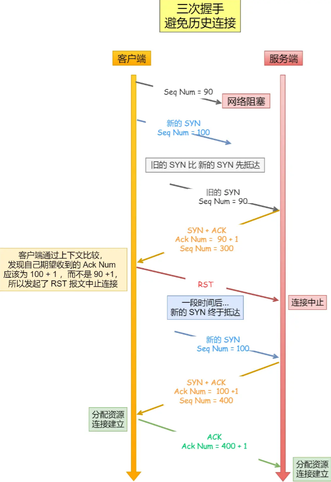

## C ++

**`final`和`override`的作用？`final`为什么能提高代码执行效率？**

- `override`：保护派生类中声明的重载函数，与基类的虚函数有相同的签名，用于编译器代码检查

- `final`：阻止类的进一步派生；阻止虚函数的进一步重写，这样可以在编译期间确定虚函数的调用版本，避免了动态绑定的开销

**`static`的作用**

- 用于函数内部修饰变量，即函数内的静态变量。这种变量的生存期长于该函数，使得函数具有一定的“状态”。
- 用在文件级别（函数体之外），修饰变量或函数，表示该变量或函数只在本文件可见，其他文件看不到、也访问不到该变量或函数。
- 用于修饰class的数据成员，即所谓“静态成员”。这种数据成员的生存期大于class的对象（实体／instance）。静态数据成员是每个class有一份，普通数据成员是每个instance有一份，因此也分别叫做class variable和instance variable。
- 用于修饰class的成员函数，即所谓“静态成员函数”。这种成员函数只能访问class variable和其他静态程序函数，不能访问instance variable或instance method。

**sizeof和strlen的区别**

- `sizeof`是一个操作符，`strlen`是库函数

- `sizeof`的参数可以是数据的类型，也可以是变量；而`strlen`只能以`\0`的字符串作为参数

- `sizeof`在编译时计算结果，`strlen`在运行时计算结果

- `sizeof`计算的是数据类型占用内存的大小，`strlen`是字符串实际的长度

**为什么`noexcept`能提高性能**

- 为实现异常捕获的功能，C++引入了“**栈回退**”机制，编译器会为函数额外生成“栈回退”的代码，使用`noexcept`可以避免生成额外的代码来处理异常情况

**`new`，`placement new`，`operator new`的区别？如何把对象`new`在栈上**

- `operator new`作用是分配一块内存，`placement new`作用是在已分配内存地址处，创建一个对象，`new`的作用则等于`operator new` + `placement new`。

- 先在栈上声明一个数组，然后通过`placement new` 在这段地址处创建对象，这就实现了在栈上`new`一个对象。

**变量声明和定义的区别？**

- 定义为变量分配地址和存储空间，声明不分配分配地址。
- 一个变量可以在多个地方声明，但只能在一个地方定义。

**构造函数可以是虚函数吗？**

- 构造函数不能是虚函数，从⽬前编译器实现虚函数进⾏多态的⽅式来看，虚函数的调⽤是通过实例化之后对象的虚函数表指针来找到虚函数的地址进⾏调⽤的，如果说构造函数是虚的，那么虚函数表指针则是不存在的，⽆法找到对应的虚函数表来调⽤虚函数，那么这个调⽤实际上也是违反了先实例化后调⽤的准则。

- 语法上通过，语义上有问题。  derived class对象内的base class成分会在derived class自身构造之前构造完毕。因此，在base class的构造函数中执行的virtual函数将会是base class的版本，决不会是derived class的版本。

**类成员函数模板可以是虚函数吗？**

- 类成员函数模板不能是虚函数，因为C++在链接前是不知道成员函数模板被实例化多少次的，这就会导致编译器无法在编译期间确定虚表的大小。

**成员函数指针和普通函数指针区别？**

- 通常来说，函数指针的长度等于机器字长，而成员函数指针长度比函数指针更长，其内部存放了对象地址和成员函数地址信息。在没有给出对象地址的情况下，调用成员函数指针会报错。

**`inline`的作用和原理？**

- C++17以前，`inline`关键字主要有两个作用：第一，作为内联优化建议，只不过是否展开函数还是由编译器决定；第二，解决符号重定义问题，不同文件内定义了同签名的函数，若被inline关键字修饰，则不会引发符号重定义错误。

- c++17开始，inline只保留第二个作用，若用户希望函数内联展开，则可以使用`__attribute((always_inline))__` 关键字，它是 GCC 和 Clang 中的一个扩展，用于强制内联函数。。  

- 原理上，第一，内联展开相比于普通函数调用，少了函数上下文压栈的过程，因此效率更高，缺点就是容易引起代码膨胀。第二，被`inline`关键字修饰的函数名，编译期间会被标记为weak符号，链接目标文件的时候，多个同签名weak符号不会引发编译器报错，运行期间，会选取其中一个函数进行调用。

**virtual函数能声明为内联吗？**

- 任何函数都可以被`inline`修饰，包括构造函数、析构函数、虚函数。这里提一下为什么虚函数可以内联，`inline`函数涉及到的是编译期解析，虚函数地址大多数情况下在运行期解析，但是某些情况下，具体调用哪个虚函数可以在编译期间确定，这个时候虚函数就能内联展开了。  
  `inline`只作为内联建议，是否展开由编译器决定，因此是可以获取`inline`函数指针的。

**`static inline`和`extern inline`含义？**

- `static inline`指的是具有文件作用域的`inline`函数；`extern inline`作用比较特殊，外部单元把它当作普通函数进行调用，同单元内把它当作`inline`函数调用。

**指针和引用的区别？**

- 引用可以看作是指针常量(指针本身是个常量，但是指向的内容可以修改)，只能在声明的时候初始化，相比于指针，引用的优势在于编译器帮我们检查地址是否初始化。

**可以在运行时访问private成员吗？**

- 可以，访问权限关键字只在编译期有效，运行期是没有访问权限关键字这些概念的。

**动态库和静态库的区别？知道动态库延迟加载优化吗？**

- 链接动态库和静态库的时候，静态库会被复制到可执行程序当中，而动态库不会。相比动态库，静态库的执行效率更高，但占用磁盘空间更多，不方便更新。动态库的延迟加载指的是，在运行时按需加载动态链接库中的函数和数据，而不是在启动的时候加载库函数和数据，从而降低启动时间，在linux系统下，延迟加载是通过PLT表和GOT表配合实现的。

**可变参数函数的实现原理？**

- 可变参数函数在编译期间，可以获取到实际参数数量和参数类型；可变参数函数运行的时候，会根据编译期间获取到的类型和大小信息，分配相应大小的栈空间，把参数按照从右到左的顺序依次压入当前函数的栈帧；当前栈帧的地址完全是可以获取到的，出于安全考虑，获取参数值前，需要通过`va_start`把参数值拷贝到`va_list`指向的堆空间，遍历`va_list`就可以获取到每个参数的值了。

**`any`可以替代`void*`吗？**

- 可以，与`void*`相比，`any`优势在于：第一，其它类型被转换成`void*`后，类型信息会发生丢失，而`any`会存储类型信息，进行类型转化时更安全；第二，`any`析构时，会自动析构堆上的对象，而`void*`需要手动管理内存。

- 劣势在于：第一，`any`内存占用更高；第二，进行类型转化，会进行类型检查，效率更低，但这点劣势可忽略不计。

**`variant`可以替代`union`吗？**

- 可以，`variant`通过可变参数模板和递归`union`的方式实现，`variant`实例化对象内存放有数据类型信息。相比于`union`，`variant`优势在于：第一，可以存储复杂类型，而`union`只能存储trivial类型；第二，`variant`存储了数据的类型信息，可以进行安全的类型转换。劣势在于，内存更大、访问效率更低。

**`sizeof(function)`大小是多少？`function`的实现方式？**

- `std::function`的大小等于2个机器字长，这是因为`std::function`可以封装任何可调用对象，其中普通函数指针长度为1个机器字长，成员函数指针长度为2个机器字长，因此为了能够封装任何可调用对象，其内存大小为2个机器字长。`std::function`内部封装有一个函数指针指向可调用对象，然后重载实现构造函数、`=`运算符、`()`运算符。

**`forward`和`move`的作用？**

- `move`有两个作用，第一，进行赋值或者拷贝的时候调用对象的移动赋值函数或者移动构造函数，把原对象在堆上的资源移为己有；第二，告诉编译器调用参数为右值引用类型的函数。

- `forward`作用是告诉编译器，是调用参数类型为左值引用类型的函数，还是调用参数类型为右值类型的函数。如果没有`move`和`forward`，任何实参传递给函数后，都会变成左值类型，这就会造成参数类型为右值引用的函数永远无法被调用。

 **模板的全特化和偏特化是什么？**

- 首先，模板函数只有全特化，没有偏特化，模板类有全特化和偏特化。模板全特化指的是，在元编程中给定所有模板参数的具体类型；模板偏特化也称为部分特化，指的是在元编程中给定部分模板参数的具体类型。引入特化和偏特化是为了给特定的类型提供单独的实现。

**模板的匹配规则是什么？**

- 模板函数的匹配顺序是：首先根据函数名进行匹配；若找到多个函数名匹配的模板，再根据参数列表进行匹配，这种匹配过程被叫做重载决议。

- 模板类的匹配顺序是：首先根据类名进行匹配；若找到多个类名匹配的模板，再按照全特化、偏特化、通用模板的的优先级进行匹配。

**`push_back()`和`emplace_back()`区别？**

- 假设容器内存放的元素类型是`T`，其定义了`T(int)`构造函数，`T(const T&)`拷贝构造，`T(T&&)`移动构造函数。首先，`push_back()`是单参数函数，参数类型是`const T&`或者`T&&`，`emplace_back()`是不定参数函数，其参数列表必须和T的普通构造函数、拷贝构造函数或者移动构造函数的参数相同；第二，`emplace_back()`通过可变参数成员函数模板实现，其编译时长比`push_back()`更长；第三，`push_back()`和`emplace_back()`的执行效率完全相同，只有一种例外情况：`push_back(2)`比`emplace_back(2)`多执行一次普通构造函数，因为前者需要通过构造函数把`2`转化为`T`类型，然后调用`push_back()`函数。

 **线程和协程的区别？为什么引入协程？**

- 两者区别是，第一，线程的调度需要切换到内核态，由操作系统完成，协程的调度在用户态完成，由用户程序程序进行调度；

- 第二，抢占式协程和抢占式线程的实现原理不同，抢占式协程由编译器插入时间片或者由操作系统信号实现，线程的抢占通过时间片中断实现。引入协程是为了实现异步非阻塞编程，传统的线程在异步资源返回前，往往会阻塞当前线程，但是引入协程后，在异步资源返回前，当前线程不必阻塞，而可以执行其它协程中的任务。

**条件变量的实现原理？**

- 互斥锁只能实现对资源的互斥访问，而不能实现线程同步，引入条件变量就是为了实现线程同步。条件变量是基于互斥锁和等待队列实现的，`wait()`调用后，若发现条件变量没有被占用，则继续执行，若发现条件变量被占用，则释放锁并阻塞当前线程，把线程放到等待队列上；`notify()`调用后，会唤醒阻塞的线程。

**条件变量和信号量区别？**

- 首先，信号量是通过互斥锁、等待队列、计数器实现的，条件变量是通过互斥锁和等待队列实现，没有计数功能；第二，信号量既可以充当互斥锁，也可以充当条件变量；第三，如果等待队列上没有任务，信号量调用notify后，信号会被保存，条件变量调用notify后，信号会丢失；通过信号量可以实现线程同步，条件变量需要和互斥锁配合使用才能实现线程同步，前者使用起来更简单，后者内存占用和性能更好。

**为什么要在父线程执行`detach()`或者`join()`？**

- 调用`detach()`或者`join()`后，子线程的状态会从`unjoinable`变为`joinable`，父线程执行结束的时候，若发现子线程状态是`joinable`则会调用`terminate()`终止子线程，反之则什么也不做。在父进程内不调用`detach()`或者`join()`，如果父线程执行完子线程还没执行完，会导致子线程异常终止。

**多态**

- 多态，即多种状态（形态）。简单来说，我们可以将多态定义为消息以多种形式显示的能力。
- 多态是以封装和继承为基础的。
- C++ 多态分类及实现：
  1. 重载多态（Ad-hoc Polymorphism，编译期）：函数重载、运算符重载
  2. 子类型多态（Subtype Polymorphism，运行期）：虚函数
  3. 参数多态性（Parametric Polymorphism，编译期）：类模板、函数模板
  4. 强制多态（Coercion Polymorphism，编译期/运行期）：基本类型转换、自定义类型转换

**如何定义一个只能在堆上（栈上）生成对象的类？**

**只能在堆上**

- 方法：将析构函数设置为私有

- 原因：C++ 是静态绑定语言，编译器管理栈上对象的生命周期，编译器在为类对象分配栈空间时，会先检查类的析构函数的访问性。若析构函数不可访问，则不能在栈上创建对象。

**只能在栈上**

- 方法：将 new 和 delete 重载为私有

- 原因：在堆上生成对象，使用 new 关键词操作，其过程分为两阶段：第一阶段，使用 new 在堆上寻找可用内存，分配给对象；第二阶段，调用构造函数生成对象。将 new 操作设置为私有，那么第一阶段就无法完成，就不能够在堆上生成对象。

**智能指针的线程安全问题：**

主要是以下几个方面：  

- **引用计数**的加减操作是线程安全的，底层使用的是`atomic`原子变量。  

-  **修改shared_ptr指向**不是线程安全的。  
  
  - 对于shared_ptr的复制则分为两个步骤：
    
    1. 复制ptr指针
    
    2. 复制引用计数指针

**不要使用裸指针初始化智能指针？**

- 因为可能存在同一个裸指针初始了多个智能指针，在智能指针析构时会造成资源的多次释放。

**知道在释放资源的时候`shared_ptr`和`unique_ptr`有什么不同吗？**

- `unique_ptr`调用了`reset()`之后就会直接释放掉，`shared_ptr`则会在所有引用计数变为0的时候才会释放申请的内存

- `unique_ptr`的`release()`方法，并不会释放资源，只会把`unique_ptr`置为空指针，原来那个资源可以继续调用

**借助shared_ptr实现copy-on-write**

- `shared_ptr::unique()`来判断是不是有人在读，如果有人在读，那么我们不能直接修改，因为read并没有全程加锁，只在获取`g_foos`时有锁

```cpp
using FooList = std::vector<Foo>;
using FooListPtr = std::shared_ptr<FooList>;
std::mutex mutex;
FooListPtr g_foos;


void read()
{
    FooListPtr foos;
    {
        lock_guard<std::mutex> lock(mutex);
        foos = g_foos;
    }
    for (auto it : foos)
    {
        it->doit();
    }
}
void write(const Foo& f) //多个写线程
{
    lock_guard<std::mutex> lock(mutex);
    if (!g_foos.unique())
    {
        // g_foos.reset(new FooList(*g_foos));
        FooListPtr newPtr = new FooList(*g_foos);
        g_foos.swap(newPtr);
    }
    g_foos->push_back(f);
}
void write(const Foo& f) //仅有单个写线程
{
    FooListPtr newPtr = new FooList(*g_foos);
    newPtr.push_back(f);
    if (newPtr)
    {
        lock_guard<std::mutex> lock(mutex);
        g_foos.swap(newPtr);
    }
}
```

**`lock_guard`和`unique_lock`区别？**

- 所有权
  
  - `unique_lock`可以手动解锁，`lock_guard`只能出作用域自动解锁

- 条件遍历的支持
  
  - 由于 `lock_guard` 无法手动解锁，因此无法满足条件变量等待和通知的需求。
  
  - `unique_lock`支持与条件变量一起使用。

**constexpr和const的区别？**

- constexpr 只能定义编译期常量，必须在编译时计算和初始化，⽽ const 可以定义编译期常量，也可以定义运⾏期常量。

**四种类型转换：**

- `static_cast`
  
  - 用于基本数据类型之间的转换，以及把任意表达式类型转换成`void`类型
  
  - 进行上行转换（派生类指针或引用转换为基类的）是安全的，由于没有动态类型检查，所以进行下行转换是不安全的

- `dynamic_cast`
  
  - 用于父子关系的强制类型转换，在下行转换时，具有类型检查功能
  - 基类一定需要虚函数：运行时转换需要类对象的信息，而类对象的信息存储在虚函数表中

- `reinterpret_cast`
  
  - 转换用于任意指针（引用）类型之间的转换，不进行类型检查。

- `const_cast`
  
  - 去掉指针或者引用的const或volatile属性

**智能指针的上下类型转换**

`static_pointer_cast`、`dynamic_pointer_cast`、`const_pointer_cast` `reinterpret_pointer_cast`

**main运行前可运行哪些代码**

- 全局对象的构造函数

- 全局变量、对象和静态变量、对象的空间分配和赋初值
  
  - 全局变量的赋值函数
  
  - 全局lambda变量调用

- 通过关键字__attribute__

**memcpy和strcpy区别**

- 复制内容：`strcpy`只能复制字符串，`memcpy`可以复制任意内容

- 复制方法：`strcpy`不需要指定长度，遇到`\0`就会结束；而`memcpy`根据第3个参数决定了复制的长度

## 网络

### TCP连接与关闭

**三次握手过程**


**为什么是三次握手？**

- 三次握手才可以阻止重复历史连接的初始化（主要原因）
  
  - 如果采用两次握手建立 TCP 连接的场景下，服务端在向客户端发送数据前，并没有阻止掉历史连接，导致服务端建立了一个历史连接，又白白发送了数据，妥妥地浪费了服务端的资源。要解决这种现象，最好就是在服务端发送数据前，也就是**建立连接之前，要阻止掉历史连接**，这样就不会造成资源浪费，而要实现这个功能，就需要三次握手。

- 三次握手才可以同步双方的初始序列号
  
  - 接收方可以去除重复的数据；接收方可以根据数据包的序列号按序接收；可以标识发送出去的数据包中， 哪些是已经被对方收到的。

三次握手才可以避免资源浪费

- 如果是**两次握手**，客户端发送的 `SYN` 报文在网络中阻塞了，重复发送多次 `SYN` 报文，那么服务端在收到请求后就会**建立多个冗余的无效链接，造成不必要的资源浪费。**



**什么是 SYN 攻击？**

我们都知道 TCP 连接建立是需要三次握手，假设攻击者短时间伪造不同 IP 地址的 `SYN` 报文，服务端每接收到一个 `SYN` 报文，就进入`SYN_RCVD` 状态，但服务端发送出去的 `ACK + SYN` 报文，无法得到未知 IP 主机的 `ACK` 应答，久而久之就会**占满服务端的半连接队列**，使得服务端不能为正常用户服务。

**如何避免 SYN 攻击？**

- 调大 netdev_max_backlog；
  - 当网卡接收数据包的速度大于内核处理的速度时，会有一个队列保存这些数据包。
- 增大 TCP 半连接队列；
- 开启 tcp_syncookies；
  - 开启 syncookies 功能就可以在不使用 SYN 半连接队列的情况下成功建立连接，相当于绕过了 SYN 半连接来建立连接。
- 减少 SYN+ACK 重传次数

**四次挥手过程**


**为什么挥手需要四次？**

- 关闭连接时，客户端向服务端发送 `FIN` 时，仅仅表示客户端不再发送数据了但是还能接收数据。
- 服务端收到客户端的 `FIN` 报文时，先回一个 `ACK` 应答报文，而服务端可能还有数据需要处理和发送，等服务端不再发送数据时，才发送 `FIN` 报文给客户端来表示同意现在关闭连接。

**为什么 TIME_WAIT 等待的时间是 2MSL？**

- `MSL` 是 Maximum Segment Lifetime，**报文最大生存时间**，它是任何报文在网络上存在的最长时间，超过这个时间报文将被丢弃。

- 如果被动关闭方没有收到断开连接的最后的 ACK 报文，就会触发超时重发 `FIN` 报文，另一方接收到 FIN 后，会重发 ACK 给被动关闭方， 一来一去正好 2 个 MSL。可以看到 **2MSL时长** 这其实是相当于**至少允许报文丢失一次**。

**为什么需要 TIME_WAIT 状态？**

- 这个时间足以让两个方向上的数据包都被丢弃，使得原来连接的数据包在网络中都自然消失，再出现的数据包一定都是新建立连接所产生的。

- 等待足够的时间以确保最后的 ACK 能让被动关闭方接收，从而帮助其正常关闭。

**TIME_WAIT 过多有什么危害？**

- 第一是占用系统资源，比如文件描述符、内存资源、CPU 资源、线程资源等；
- 第二是占用端口资源，端口资源也是有限的，一般可以开启的端口为 `32768～61000`，也可以通过 `net.ipv4.ip_local_port_range`参数指定范围。

**服务器出现大量 TIME_WAIT 状态的原因有哪些？**

- 首先要知道 **TIME_WAIT 状态是主动关闭连接方才会出现的状态**，所以如果服务器出现大量的 TIME_WAIT 状态的 TCP 连接，就是说明服务器主动断开了很多 TCP 连接。

- 第一个场景：HTTP 没有使用长连接

- 第二个场景：HTTP 长连接超时，nginx触发回调关闭超时连接

- 第三个场景：HTTP 长连接的请求数量达到上限，此时nginx 会主动关闭这个长连接

**服务器出现大量 CLOSE_WAIT 状态的原因有哪些？**

CLOSE_WAIT 状态是「被动关闭方」才会有的状态，而且如果「被动关闭方」没有调用 close 函数关闭连接，那么就无法发出 FIN 报文，从而无法使得 CLOSE_WAIT 状态的连接转变为 LAST_ACK 状态。

我们先来分析一个普通的 TCP 服务端的流程：

1. 创建服务端 socket，bind 绑定端口、listen 监听端口
2. 将服务端 socket 注册到 epoll
3. epoll_wait 等待连接到来，连接到来时，调用 accpet 获取已连接的 socket
4. 将已连接的 socket 注册到 epoll
5. epoll_wait 等待事件发生
6. 对方连接关闭时，我方调用 close

可能导致服务端没有调用 close 函数的原因，如下：

- **第一个原因**：第 2 步没有做，没有将服务端 socket 注册到 epoll，这样有新连接到来时，服务端没办法感知这个事件，也就无法获取到已连接的 socket，那服务端自然就没机会对 socket 调用 close 函数了。不过这种原因发生的概率比较小，这种属于明显的代码逻辑 bug，在前期 read view 阶段就能发现的了。

- **第二个原因**： 第 3 步没有做，有新连接到来时没有调用 accpet 获取该连接的 socket，导致当有大量的客户端主动断开了连接，而服务端没机会对这些 socket 调用 close 函数，从而导致服务端出现大量 CLOSE_WAIT 状态的连接。发生这种情况可能是因为服务端在执行 accpet 函数之前，代码卡在某一个逻辑或者提前抛出了异常。

- **第三个原因**：第 4 步没有做，通过 accpet 获取已连接的 socket 后，没有将其注册到 epoll，导致后续收到 FIN 报文的时候，服务端没办法感知这个事件，那服务端就没机会调用 close 函数了。发生这种情况可能是因为服务端在将已连接的 socket 注册到 epoll 之前，代码卡在某一个逻辑或者提前抛出了异常。

- **第四个原因**：第 6 步没有做，当发现客户端关闭连接后，服务端没有执行 close 函数，可能是因为代码漏处理，或者是在执行 close 函数之前，代码卡在某一个逻辑，比如发生死锁等等。

**如果已经建立了连接，但是服务端的进程崩溃会发生什么？**

TCP 的连接信息是由内核维护的，所以当服务端的进程崩溃后，内核需要回收该进程的所有 TCP 连接资源，于是内核会发送第一次挥手 FIN 报文，后续的挥手过程也都是在内核完成，并不需要进程的参与，所以即使服务端的进程退出了，还是能与客户端完成 TCP 四次挥手的过程。

### Socket 编程


Linux内核中会维护两个队列：

- 半连接队列（SYN 队列）：接收到一个 SYN 建立连接请求，处于 SYN_RCVD 状态；
- 全连接队列（Accpet 队列）：已完成 TCP 三次握手过程，处于 ESTABLISHED 状态；


三次握手状态：


四次挥手状态：


**TCP有限机状态图**


### TCP 拥塞控制

**拥塞控制**

- 拥塞窗口cwnd是发送⽅维护的⼀个状态变量，根据⽹络拥塞程度⽽变化。

- 发送窗⼜的值是swnd = min(cwnd, rwnd)，也就是拥塞窗口和接收窗口中的最⼩值。

- ⽹络中没有出现拥塞，cwnd增⼤，出现拥塞，cwnd减⼩。

拥塞控制就是防止过多的数据注入到网络中，这样可以使网络中的路由器或链路不致过载。

- 慢开始( slow-start )
- 拥塞避免( congestion avoidance )
- 快重传( fast retransmit )
- 快恢复( fast recovery )


**`RST`产生的几种情况**

## 系统

**页面置换算法**

在地址映射过程中，若在页面中发现所要访问的页面不在内存中，则产生缺页中断。当发生缺页中断时，如果操作系统内存中没有空闲页面，则操作系统必须在内存选择一个页面将其移出内存，以便为即将调入的页面让出空间。而用来选择淘汰哪一页的规则叫做页面置换算法。

全局：

- 工作集算法
- 缺页率置换算法

局部：

- 最佳置换算法（OPT）
- 先进先出置换算法（FIFO）
- 最近最久未使用（LRU）算法
- 时钟（Clock）置换算法

**vmalloc()和kmalloc()区别**

- kmalloc保证分配的内存在物理上是连续的,那么它对应的虚拟内存肯定也是连续的;而vmalloc保证的是在虚拟地址空间上的连续

- kmalloc一般分配较小的内存,vmalloc分配较大的内存

- vmalloc比kmalloc要慢,且分配的虚拟地址空间位置不同.这两个函数所分配的内存虽然都处于内核空间(3GB～4GB),但对应的具体位置不同，kmalloc()分配的内存处于3GB～high_memory之间，而vmalloc()分配的内存在VMALLOC_START～VMALLOC_END之间，也就是非连续内存区。kmalloc分配的内存,它的物理地址与虚拟地址只有一个PAGE_OFFSET偏移，不需要为地址段修改页表,而vmalloc分配内存时需要修改主内核页表

**进程之间私有和共享的资源**

- 私有：地址空间，堆，全局变量，栈，寄存器

- 共享：代码段，公共数据，进程目录，进程ID

**线程之间私有和共享的资源**

- 私有：线程栈，寄存器，程序计数器

- 共享：堆，地址空间，全局变量，静态变量

**栈保存哪些信息**

- 函数的返回地址和参数

- 临时变量：包括函数的非静态局部变量以及编译器自动生成的临时变量

- 保存上下文：包括函数调用前后需要保持不变的寄存器

**地址空间（用户空间）**

- 代码段text：程序的二进制可执行代码，只读

- 数据段data：已初始化的全局变量和静态变量

- BSS段：未初始化的静态变量和全局变量

- 堆段：动态分配的内存，从低地址开箱向上增长

- 文件映射段：包括动态库、共享内存等，从低地址开始向上增长

- 栈段：包括函数的参数值和局部变量、函数调用的上下文等
