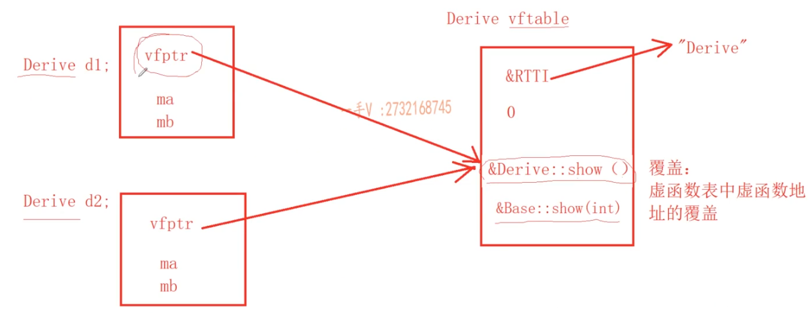
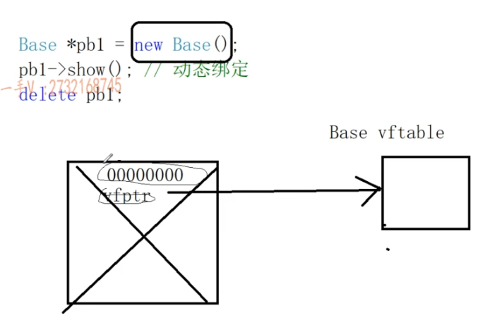
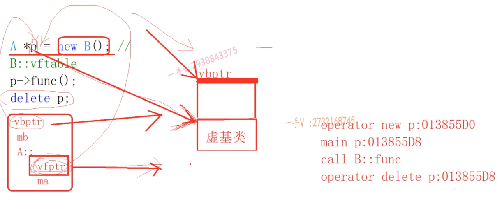
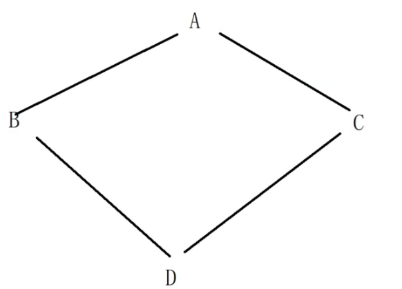
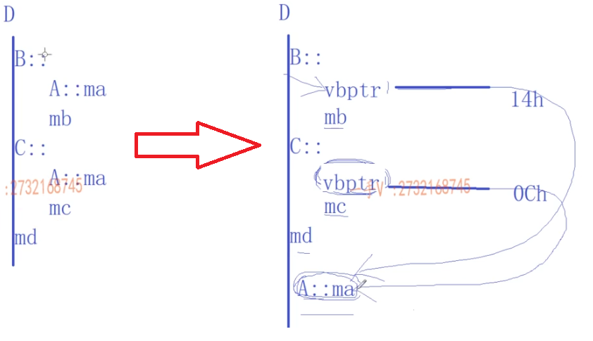

## Template

编译器是没办法去根据返回值推断类型的。

```cpp
float data[1024];

template <typename T> T GetValue(int i)
{
    return static_cast<T>(data[i]); 
}

float a = GetValue(0);    // 出错了！
int b = GetValue(1);    // 也出错了！
```

在部分推导、部分指定的情况下，编译器对模板参数的顺序是有限制的：**先写需要指定的模板参数，再把能推导出来的模板参数放在后面**。

在这个例子中，能推导出来的是 `SrcT`，需要指定的是 `DstT`。

```cpp
template <typename DstT, typename SrcT> DstT c_style_cast(SrcT v)    // 模板参数 DstT 需要人肉指定，放前面。
{
    return (DstT)(v);
}

int v = 0;
float i = c_style_cast<float>(v);  // 形象地说，DstT会先把你指定的参数吃掉，剩下的就交给编译器从函数参数列表中推导啦。 
```

# C++基础

## const

C++中，所有出现const常量名字的地方，都被常量的初始化替换了

```cpp
    const int a = 20;
    int *p = (int*)&a;
    *p = 30;
    printf("%d %d %d \n", a, *p, *(&a)); //20 30 30
```

```cpp
    int b = 20;
    const int a = b; //所有的a用临时变量b替换
    int *p = (int*)&a;
    *p = 30;
    printf("%d %d %d \n", a, *p, *(&a)); //30 30 30
```

**常见错误**：

1. 不能作为左值 -> 直接修改常量的值
2. 不能把常量的地址泄露给一个普通指针或者普通的引用变量 -> 间接修改常量的值

```cpp
    const int a =20
    //a = 30; // 不能作为左值 -> 直接修改常量的值
    //int *p = &a; //不能把常量的地址泄露给一个普通指针或者普通的引用变量 -> 间接修改常量的值
    const int *p = &a;
```

**总结const和指针的类型转换**：

```cpp
to              from
int*            const int*    //是错误的！
const int*      int*          //是可以的！

int**           const int**   //是错误的！
const int**     int**         //是错误的！

int**           int*const*    //是错误的！
int*const*      int**         //是可以的！
```

```cpp
    int a = 10;
    const int *p = &a;
    int *q = p; //invalid conversion from ‘const int*’ to ‘int*’
```

```cpp
    int a = 10;
    int *p = &a;
    const int **q = &p; //相当于 *q <=> p，将常量的地址泄露给一个普通指针
```

## 引用

**引用的本质是指针**

定义一个引用变量，和定义一个指针变量，其汇编指令是一模一样的；通过引用变量修改内存的值，和通过指针解引用修改指针指向的内存的值，其底层指令也是一模一样的。

```cpp
    int array[5] = {};
    int *p = array;
    // 定义一个引用变量，来引用array数组
    int (&q)[5] = array; // int (*q)[5] = &array;

    cout << sizeof(array) << endl; // 20
    cout << sizeof(p) << endl; // 8
    cout << sizeof(q) << endl; // 20
    cout << sizeof(int*) << endl; // 8
```

**右值引用**

1. 专门用来引用右值类型，指令上，可以自动产生临时量然后直接引用临时量

2. 右值引用本身是一个左值，只能用左值引用来引用它

3. 不能用一个右值引用变量，来引用一个左值

```cpp
    int a = 10; // a是左值，它有内存，有名字，值可以修改
    int &b = a;

    int &&c = 20; // 20是右值，它没有内存，没有名字（临时量）
    c = 30;

    int &e = c; // 一个右值引用变量，其本身是个左值
```

## new 和 malloc

malloc 和 free，称作 c 的库函数

new 和 delete，称作运算符

new不仅可以做内存开辟，还可以做内存初始化操作

malloc开辟内存失败，是通过返回值和nullptr做比较：而new开辟内存失败，是通过抛出bad_alloc类型的异常来判断的。

new 可以认为是 malloc + 构造函数， delete 可以认为是 free + 析构函数

```cpp
    // new有多少种
    int *p1 = new int(10);
    int *p2 = new (nothrow) int;
    const int *p3 = new const int(40);

    //定位new
    int data = 0;
    int *p4 = new (&data) int(50);
    cout << data << endl; // 50
```

1. `malloc`和`new`的区别
   
   1. `malloc`按字节开辟内存；`new`开辟内存时需要指定类型，如`new int[10]`；所以`malloc`开辟内存都是`void*`
   
   2. `malloc`只负责开辟内存，`new`不仅仅有`malloc`的功能，可以进行数据的初始化
   
   3. `malloc`开辟内存返回`nullptr`指针；`new`抛出的是`bad_alloc`类型的异常

2. `free`和`delete`的区别
   
   `delete (int*)p:`先调用析构函数，后`free(p)`

```cpp
#include <iostream>
using namespace std;

void* operator new(size_t size)
{
    void* p = malloc(size);
    if (nullptr == p)
    {
        throw bad_alloc();
    }
    cout << "operator new addr:" << p << endl;
    return p;
}
void operator delete(void* ptr)
{
    cout << "operator delete addr:" << ptr << endl;
    free(ptr);
}

void* operator new[](size_t size)
{
    void* p = malloc(size);
    if (nullptr == p)
    {
        throw bad_alloc();
    }
    cout << "operator new[] addr:" << p << endl;
    return p;
}
void operator delete[](void* ptr)
{
    cout << "operator delete[] addr:" << ptr << endl;
    free(ptr);
}

class Test
{
public:
    Test(int data = 10) { cout << "Test()" << endl;}
    ~Test() { cout << "~Test()" << endl; }

#if 0
    Test(int data = 10) :ptr(new int(data)) { cout << "Test()" << endl;}
    ~Test() { cout << "~Test()" << endl; delete ptr; }
#endif
private:
    int *ptr;
};

int main()
{
#if 0
    Test *p1 = new Test();
    delete p1;
#endif

    Test *p2 = new Test[2];
    cout << "p2[0]:" << &p2[0] << endl; // p2[0]的地址和申请内存地址不一样，需要额外记录数组元素个数
    delete[] p2;

#if 0
    try
    {
        int *p = new int; // 调用operator new分配内存，然后调用int的构造函数初始化
        delete p; // 调用ptr指向对象的析构函数，然后调用operator delete释放ptr指向的内存

        int *q = new int[10];
        delete[] q;
    }
    catch(const bad_alloc& e)
    {
        std::cerr << e.what() << '\n';
    }
#endif   

    return 0;
}
```

频繁`malloc`和`free`效率低下，考虑使用对象池进行分配内存

```cpp
#include <iostream>
using namespace std;

template <typename T>
class Queue
{
public:
    Queue()
    {
        _front = _rear = new QueueItem();
    }
    ~Queue()
    {
        while (_front)
        {
            _rear = _front->_next;
            delete _front;
            _front = _rear;
        }
    }
    void push(const T &val)
    {
        QueueItem *item = new QueueItem(val);
        _rear->_next = item;
        _rear = item;
    }
    void pop()
    {
        if (empty())
        {
            return;
        }
        QueueItem *p = _front->_next; // p指向队头元素
        _front->_next = p->_next;     // 队头元素出队
        if (_front->_next == nullptr) // 如果队列中只有一个元素，出队后队列为空
        {
            _rear = _front;
        }
        delete p;
    }
    T front() const
    {
        return _front->_next->_data;
    }
    T back() const
    {
        return _rear->_data;
    }
    bool empty() const
    {
        return _front == _rear;
    }

private:
    // 产生一个QueueItem的对象池（10000个QueueItem节点）
    struct QueueItem // 队列中的节点
    {
        QueueItem(T data = T()) : _data(data), _next(nullptr) {}
        // 给QueueItem提供自定义内存管理
        void *operator new(size_t size)
        {
            if (_itemPool == nullptr)
            {
                _itemPool = (QueueItem *)new char[POOL_ITEM_SIZE * sizeof(QueueItem)];
                QueueItem *p = _itemPool;
                for (int i = 0; i < POOL_ITEM_SIZE - 1; i++)
                {
                    p->_next = (QueueItem *)((char *)p + sizeof(QueueItem));
                    p = p->_next;
                }
                p->_next = nullptr;
            }

            QueueItem *p = _itemPool; // 从对象池中取出一个节点
            _itemPool = _itemPool->_next; // 对象池中的可用节点数减1，指向下一个可用节点
            return p; // 返回取出的节点
        }
        void operator delete(void *ptr)
        {
            QueueItem *p = (QueueItem *)ptr;
            p->_next = _itemPool; // 把释放的节点放回对象池中
            _itemPool = p;
        }
        T _data;
        QueueItem *_next;
        static QueueItem *_itemPool;
        static const int POOL_ITEM_SIZE = 10000;
    };

    QueueItem *_front; // 队头的前一个节点，头节点
    QueueItem *_rear;  // 队尾
};

template <typename T>
typename Queue<T>::QueueItem *Queue<T>::QueueItem::_itemPool = nullptr;

int main()
{
    Queue<int> que;
    for (int i = 0; i < 1000000; i++)
    {
        que.push(i);
        que.pop();
    }
    cout << que.empty() << endl;

    return 0;
}
```

## 面向对象

## Template

### 函数模板

```cpp
// 函数模板，是不进行编译的，因为类型还不知道
// 函数实例化，函数调用点进行实例化
// 模板函数，才是要被编译器所编译的
// 模板的实参推演，可以根据用户传入的实参的类型，来推导出模板类型
// 模板的特例化（专用化），特殊（不是编译器提供的，而是用户提供的）实例化

template<typename T>  //定义一个模板参数列表
bool compare(T a, T b) // compare 是一个函数模板
{
  cout << "template compare" << endl;
  return a > b;
}

// 在函数调用点，编译器用用户指定的类型，从原模板实例化一份函数代码出来
/*
bool compare<int>(int a, int b) // compare 是一个函数模板
{
  return a > b;
}
*/

// 针对 compare 函数模板，提供 const char* 类型的特例化版本
template<>
bool compare<const char *>(const char *a, const char *b)
{
  return strcmp(a, b) > 0;
}

int main()
{
  // 函数调用点
  compare<int> (10, 20);
  compare<double> (10.5, 20.5);
  return 0;
}
```

模板代码是不能在一个文件定义，在另一个文件使用

模板代码调用之前，一定要看到模板定义的地方，这样的话，模板才能够进行正常的实例化，产生能够被编译器编译的代码

所以，模板代码都是放在头文件中，然后在源代码当中直接进行 `#include`包含。

### 类模板

类模板 =》 实例化 =》 模板类`class SeqStack<int>{}`

```cpp
template<typename T>
class SeqStack
{
public:
    // 构造和析构函数名不用加<T>，其它出现模板的地方都要加上类型参数列表
    SeqStack(int size = 10)
        : _pstack(new T[size])
        , _top(0)
        , _size(size)
    {}
    ~SeqStack()
    {
        delete[] _pstack;
        _pstack = nullptr;
    }
    SeqStack(const SeqStack<T>& stack)
        : _top(stack._top)
        , _size(stack._size)
    {
        _pstack = new T[stack._size];
        for (int i = 0; i < stack._top; ++i)
        {
            _pstack[i] = stack._pstack[i];
        }
        _top = stack._top;
        _size = stack._size;
    }
    SeqStack<T>& operator=(const SeqStack<T>& stack)
    {
        if (this != &stack)
        {
            delete[] _pstack;
            _pstack = new T[stack._size];
            for (int i = 0; i < stack._top; ++i)
            {
                _pstack[i] = stack._pstack[i];
            }
            _top = stack._top;
            _size = stack._size;
        }
        return *this;
    }

    void Push(const T& x)
    {
        if (IsFull())
        {
            expand();
        }
        _pstack[_top++] = x;
    }
    void Pop()
    {
        if (IsEmpty())
        {
            return;
        }
        --_top;
    }
    T& GetTop() const
    {
        return _pstack[_top - 1];
    }
    bool IsEmpty() const
    {
        return _top == 0;
    }
    bool IsFull() const
    {
        return _top == _size;
    }
    int GetSize() const
    {
        return _top;
    }

private:
    T *_pstack;
    int _top;
    int _size;

    void expand()
    {
        T *p = new T[_size * 2];
        for (int i = 0; i < _size; ++i)
        {
            p[i] = _pstack[i];
        }
        delete[] _pstack;
        _pstack = p;
        _size *= 2;
    }
};
```

上面的代码使用`SeqStack<Test> s;`会默认构造10个`Test()`，需要对容器底层内存实现额外的空间配置器

```cpp
#include <iostream>
using namespace std;

template <typename T>
class Allocator
{
public:
    T *allocate(size_t size)
    {
        return (T *)malloc(size * sizeof(T));
    }
    void deallocate(T *p)
    {
        free(p);
    }
    void construct(T *p, const T &x)
    {
        new (p) T(x);
    }
    void destroy(T *p)
    {
        p->~T();
    }
};

// 容器底层内存开辟，内存释放，对象构造和析构，都通过allocator来完成
template <typename T, typename Alloc = Allocator<T>>
class SeqStack
{
public:
    // 构造和析构函数名不用加<T>，其它出现模板的地方都要加上类型参数列表
    SeqStack(int size = 10, const Alloc &alloc = Allocator<T>()) // 需要把内存开辟和对象构造分开处理
                                                                 //  : _pstack(new T[size])
                                                                 //  , _top(0)
                                                                 //  , _size(size)
    {
        _pstack = _allocator.allocate(size);
        _top = 0;
        _size = size;
    }
    ~SeqStack()
    {
        // 析构有效的元素，然后释放_pstack指针指向的堆内存
        // delete[] _pstack;
        for (int i = 0; i < _top; ++i)
        {
            _allocator.destroy(&_pstack[i]); // 析构对象
        }
        _allocator.deallocate(_pstack); // 释放堆上的数组内存
        _pstack = nullptr;
    }
    SeqStack(const SeqStack<T> &stack)
        : _top(stack._top), _size(stack._size)
    {
        // _pstack = new T[stack._size];
        _pstack = _allocator.allocate(stack._size);
        for (int i = 0; i < stack._top; ++i)
        {
            _pstack[i] = stack._pstack[i];
        }
        _top = stack._top;
        _size = stack._size;
        cout << "SeqStack(const SeqStack<T> &stack)" << endl;
    }
    SeqStack<T> &operator=(const SeqStack<T> &stack)
    {
        if (this != &stack)
        {
            // delete[] _pstack;
            for (int i = 0; i < _top; ++i)
            {
                _allocator.destroy(&_pstack[i]); // 析构对象
            }
            _allocator.deallocate(_pstack); // 释放堆上的数组内存
            _pstack = nullptr;
            // _pstack = new T[stack._size];
            _pstack = _allocator.allocate(stack._size);
            for (int i = 0; i < stack._top; ++i)
            {
                _pstack[i] = stack._pstack[i];
            }
            _top = stack._top;
            _size = stack._size;

            cout << "SeqStack<T> &operator=(const SeqStack<T> &stack)" << endl;
        }
        return *this;
    }

    void Push(const T &x)
    {
        if (IsFull())
        {
            expand();
        }
        // _pstack[_top++] = x;
        _allocator.construct(&_pstack[_top++], x);
    }
    void Pop()
    {
        if (IsEmpty())
        {
            return;
        }
        --_top;
        _allocator.destroy(&_pstack[_top]);
    }
    T &GetTop() const
    {
        return _pstack[_top - 1];
    }
    bool IsEmpty() const
    {
        return _top == 0;
    }
    bool IsFull() const
    {
        return _top == _size;
    }
    int GetSize() const
    {
        return _top;
    }

private:
    T *_pstack;
    int _top;
    int _size;
    Alloc _allocator;

    void expand()
    {
        // T *p = new T[_size * 2];
        T *p = _allocator.allocate(_size * 2);

        for (int i = 0; i < _size; ++i)
        {
            // p[i] = _pstack[i];
            _allocator.construct(&p[i], _pstack[i]);
        }

        // delete[] _pstack;
                for (int i = 0; i < _top; ++i)
        {
            _allocator.destroy(&_pstack[i]); // 析构对象
        }
        _allocator.deallocate(_pstack); // 释放堆上的数组内存
        _pstack = nullptr;

        _pstack = p;
        _size *= 2;
    }
};

class Test
{
public:
    Test() { cout << "Test()" << endl; }
    Test(const Test &t) { cout << "Test(const Test &t)" << endl; }
    Test &operator=(const Test &t)
    {
        cout << "Test &operator=(const Test &t)" << endl;
        return *this;
    }
    Test(const Test &&t) { cout << "Test(const Test &&t)" << endl; }

    ~Test() { cout << "~Test()" << endl; }
};

int main()
{
    Test t1;
    cout << "------------" << endl;
    SeqStack<Test> s;
    s.Push(t1);
    s.Pop();
    cout << "------------" << endl;

    return 0;
}
```

输出如下：

```shell
Test()
------------
Test(const Test &t)
~Test()
------------
~Test()
```

编译器做对象运算的时候，会调用对象的运算符重载函数（优先调用成员方法）；如果没有成员方法，就在全局作用域找合适的运算符重载函数。

## 迭代器

进行元素增删之后，之前定义的迭代器会失效

```cpp
    vector<int> vec;
    for (int i = 0; i < 20; i ++)
    {
        vec.push_back(i);
    }
    auto it1 = vec.end();
    vec.pop_back(); // it1失效
```

## 继承与多态

### 继承权限

```cpp
继承方式    基类的访问限定    派生类的访问限定    外部的访问限定
public      public           public             Yes
public      protected        protected          No
public      private          No                 No
protected   public           protected          No
protected   protected        protected          No
protected   private          No                 No
private     public           private            No
private     protected        private            No
private     private          No                 No
```

总结：

1. 外部只能访问对象public成员，protected成员和private成员都不能访问

2. 在继承机构中，派生类从基类可以继承过来private的成员，但是派生类却无法直接访问

3. protected和private的区别？
   
   在基类中定义的成员，想被派生类访问，但是不想被外部访问，那么在基类中，把相关成员定义成protected保护的；
   
   如果派生类和外部都不打算访问，那么在基类中，把相关成员定义成private私有的。

默认的继承方式？

要看派生类是用class定义的（private），还是struct定义的（public）。

### 派生类构造过程

```cpp
#include <iostream>
using namespace std;

/*
1.派生类从基类可以继承过来所有的成员，除过构造函数和析构函数

派生类怎么初始化基类继承来的成员变量？
通过调用基类相应的构造函数来初始化

派生类的构造函数和析构函数，负责初始化和清理派生类部分
派生类从基类继承来的成员的初始化和清理，由基类的构造函数和析构函数负责

派生类对象构造和析构的过程是：
1.派生类调用基类的构造函数吗，初始化从基类继承来的成员
2.调用派生类自己的构造函数，初始化派生类自己特有的成员
3.调用派生类的析构函数吗，释放派生类成员可能占用的外部资源（堆内存，文件）
4.调用基类的析构函数，释放从基类继承来的成员可能占用的外部资源（堆内存，文件）
*/
class Base
{
public:
    Base(int data) : ma(data) {cout << "Base()" << endl;}
    ~Base() {cout << "~Base()" << endl;}
protected:
    int ma;
private:

};
class Derive : public Base
{
public:
    Derive(int data) :Base(data), mb(data) {cout << "Derive()" << endl;}
    ~Derive() {cout << "~Derive()" << endl;}

protected:

private:
    int mb;

};

int main()
{
    Derive d(10);

    return 0;
}
```

### 重载、覆盖、隐藏

```cpp
#include <iostream>
#include <typeinfo>
using namespace std;

/*
重载、隐藏、覆盖
1.重载关系
一组函数要重载，必须处于同一个作用域中；而且函数名字相同，参数列表不同

2.隐藏（作用域的隐藏）关系
在继承机构中，派生类的同名成员，把基类的同名成员给隐藏调用了
*/

class Base
{
public:
    Base(int data = 10) : ma(data) { cout << "Base()" << endl; }
    ~Base() { cout << "~Base()" << endl; }

    void show() { cout << "Base::show()" << endl; }
    void show(int data) { cout << "Base::show(int data)" << endl; }

protected:
private:
    int ma;
};
class Derive : public Base
{
public:
    Derive(int data = 20) : Base(data), mb(data) { cout << "Derive()" << endl; }
    ~Derive() { cout << "~Derive()" << endl; }

    void show() { cout << "Derive::show()" << endl; }

protected:
private:
    int mb;
};

int main()
{
    Base b(10);
    Derive d(20);
    b = d;
    b.show(); // 基类的show（）

    Base *pb = &d;
    pb->show(); // 静态绑定，Base::show()
    pb->show(10); // 静态绑定，Base::show(int data)

    cout << sizeof(Base) << endl; // 4
    cout << sizeof(Derive) << endl; // 8

    cout << typeid(pb).name() << endl; // P4Base
    cout << typeid(*pb).name() << endl; // 4Base

#if 0
    Derive d;
    d.show();
    // d.show(10); // 会将基类中的show()和show(int data)隐藏掉
    d.Base::show(10);
#endif
    return 0;
}
```

### 虚函数和动态绑定



```cpp
#include <iostream>
#include <typeinfo>
using namespace std;

/*
虚函数和动态绑定

总结一：
一个类里面定义了虚函数，那么编译阶段，编译器给这个类类型产生一个唯一的vftable虚函数表，里面存放着RTTI指针和虚函数的地址。
当程序运行时，每一张虚函数表都会加载到内存的.rodata区。

总结二：
一个类里面定义了虚函数，那么这个类定义的对象，其运行时，内存中的开始部分，多存储一个vfptr虚函数指针，
指向相应类型的虚函数表vftable。一个类型定义的n个对象，vfptr指向的都是同一个虚函数表。

总结三：
一个类里面虚函数的个数，不影响对象内存大小（vfptr），但是影响虚函数表的大小。
*/

class Base
{
public:
    Base(int data = 10) : ma(data) { cout << "Base()" << endl; }
    ~Base() { cout << "~Base()" << endl; }

    virtual void show() { cout << "Base::show()" << endl; }
    virtual void show(int data) { cout << "Base::show(int data)" << endl; }

protected:
private:
    int ma;
};
class Derive : public Base
{
public:
    Derive(int data = 20) : Base(data), mb(data) { cout << "Derive()" << endl; }
    ~Derive() { cout << "~Derive()" << endl; }

    /*
    总结四：
    如果派生类中的方法，和基类继承来的某个方法，返回值、函数名、参数列表都相同，
    而且基类的方法是virtual虚函数，那么派生类的这个方法，自动处理成virtual虚函数。
    */
    void show() { cout << "Derive::show()" << endl; }

protected:
private:
    int mb;
};

int main()
{
    Derive d(20);

    Base *pb = &d;
    /*
    如果发现show是普通函数，就进行静态绑定
    如果发现show是虚函数，就进行动态绑定
    */
    pb->show(); // Derive::show()
    pb->show(10); // Base::show(int data)

    cout << sizeof(Base) << endl; // 4 -> 16
    cout << sizeof(Derive) << endl; // 8 -> 16
    cout << sizeof(int) << endl; // 4

    cout << typeid(pb).name() << endl; // P4Base
    cout << typeid(*pb).name() << endl; // 6Derive

    return 0;
}
```

### 虚析构函数

```cpp
#include <iostream>
#include <typeinfo>
using namespace std;

/*
问题一：哪些函数不能实现成虚函数

虚函数依赖：
1.虚函数能产生地址，存储在vftable当中
2.对象必须存在（vfptr -> vftable -> 虚函数地址）

构造函数
1.virtual + 构造函数 NO!
2.构造函数中（调用的任何函数，都是静态绑定的）调用虚函数，也不会发生静态绑定
派生类对象构造过程 1.先调用的是基类的构造函数 2.再调用的是派生类的构造函数

static静态方法 NO! 

问题二：虚析构函数 析构函数调用的时候，对象是存在的
什么时候把基类的析构函数必须是现成虚函数？
基类的指针（引用）指向堆上new出来的派生类对象的时候，delete pb(基类的指针)，
它调用析构函数的时候，必须发生动态绑定，否则会导致派生类的析构函数不会被调用
*/

class Base
{
public:
    Base(int data = 10) : ma(data) { cout << "Base()" << endl; }
    virtual ~Base() { cout << "~Base()" << endl; }

    virtual void show() { cout << "Base::show()" << endl; }
    virtual void show(int data) { cout << "Base::show(int data)" << endl; }

protected:
    int ma;
private:
};
class Derive : public Base
{
public:
    Derive(int data = 20) : Base(data), mb(data) { cout << "Derive()" << endl; }
    ~Derive() { cout << "~Derive()" << endl; }

protected:
private:
    int mb;
};

int main()
{
    Base *pb = new Derive(10);
    pb->show(); // Derive::show()
    /*
    如果没有将基类的虚构函数声明为虚函数，那么delete，只会调用基类的析构函数
    pb->Base Base::~Base 对于析构函数的调用，是静态绑定的
    call Base::~Base
    */
    delete pb;

    return 0;
}
```

### 再谈动态绑定

```cpp
#include <iostream>
using namespace std;

/*
虚函数和动态绑定 问题：是不是虚函数的调用一定就是动态绑定？ 不是
在类的构造函数当中，调用虚函数，也是静态绑定（构造函数中调用其它虚函数，不会发生动态绑定）
*/

class Base
{
public:
    Base(int data = 10) : ma(data) { cout << "Base()" << endl; }
    virtual ~Base() { cout << "~Base()" << endl; }

    virtual void show() { cout << "Base::show()" << endl; }
    // virtual void show(int data) { cout << "Base::show(int data)" << endl; }

protected:
    int ma;
};
class Derive : public Base
{
public:
    Derive(int data = 20) : Base(data), mb(data) { cout << "Derive()" << endl; }
    ~Derive() { cout << "~Derive()" << endl; }
    void show() { cout << "Derive::show()" << endl; }

private:
    int mb;
};

int main()
{
    Base b;
    Derive d;

    // 用对象本身调用虚函数，是静态绑定
    b.show(); // call Base::show()
    d.show(); // call Derive::show()

    // 用指针调用虚函数，是动态绑定
    Base *pb1 = &b;
    Base *pb2 = &d;
    pb1->show(); 
    pb2->show(); 

    // 用引用调用虚函数，是动态绑定
    Base &rb1 = b;
    Base &rb2 = d;
    rb1.show();
    rb2.show();

    // 派生类指针指向基类对象，调用虚函数，是动态绑定
    Derive *pd2 = (Derive *)&b;
    pd2->show(); // Base::show()

    return 0;
}
```

### 理解多态

派生类的vfptr可以被替换

```cpp
#include <iostream>
#include <typeinfo>
#include <string>
using namespace std;

/*
如何解释多态？
静态（编译时期）的多态：函数重载、模板
动态（运行时期）的多态：
在继承结构中，基类指针（引用）指向派生类对象，通过该指针（引用）调用同名覆盖方法（虚函数），
基类指针指向哪个派生类对象，就会调用哪个派生类对象的同名覆盖方法（虚函数），成为多态
pbase->show();
多态底层是通过动态绑定来实现的，pbase =》 访问谁的vfptr =》 继续访问谁的vftable =》 调用对应的派生类对象的方法

继承的好处是什么？
1.可以做代码的复用
2.在基类中提供统一的虚函数接口，让派生类进行重写，然后就可以使用多态了
*/

/*
抽象类和普通类有什么区别？
一般把什么类设计成抽象类？
*/

/*
定义Animal的初衷，并不是让Animal抽象某个实体的类型
1.string _name; 让所有的动物实体类通过继承Animal直接复用该属性
2.bark()；给所有的派生类保留统一的覆盖/重写接口

拥有纯虚函数的类，叫做抽象类；抽象类不能再实例化对象了，但是可以定义指针和引用变量
*/

// 动物抽象基类
class Animal
{
public:
    Animal(string name) : _name(name) { cout << "Animal()" << endl; }
    virtual ~Animal() { cout << "~Animal()" << endl; }

    virtual void bark() = 0;

protected:
    string _name;
};

class Cat : public Animal
{
public:
    Cat(string name) : Animal(name) { cout << "Cat()" << endl; }
    ~Cat() { cout << "~Cat()" << endl; }

    void bark() { cout << _name << "Cat::speak()" << endl; }
};
class Dog : public Animal
{
public:
    Dog(string name) : Animal(name) { cout << "Dog()" << endl; }
    ~Dog() { cout << "~Dog()" << endl; }

    void bark() { cout << _name << "Dog::speak()" << endl; }
};
class Pig : public Animal
{
public:
    Pig(string name) : Animal(name) { cout << "Pig()" << endl; }
    ~Pig() { cout << "~Pig()" << endl; }

    void bark() { cout << _name << "Pig::speak()" << endl; }
};
void bark(Animal &animal) // 给外部提供一个统一的接口，让外部调用者传入不同的动物对象
{
    animal.bark(); // Animal::bark()虚函数，动态绑定
}

int main()
{
#if 0
    Cat cat("猫咪");
    Dog dog("旺财");
    Pig pig("佩奇");

    bark(cat);
    bark(dog);
    bark(pig);
#endif

#if 1
    Animal *p1 = new Cat("加菲猫");
    Animal *p2 = new Dog("二哈");

    int *p11 = (int *)p1;
    int *p22 = (int *)p2;
    int tmp = p11[0]; // p11[0]是Cat的前四个字节，也就是vfptr
    p11[0] = p22[0]; // vfptr -> Dog的vftable
    p22[0] = tmp;   // vfptr -> Cat的vftable

    p1->bark(); // 加菲猫Dog::speak()
    p2->bark(); // 二哈Cat::speak()

    delete p1;
    delete p2;
#endif

    return 0;
}
```

访问权限只是在编译阶段进行检查的

```cpp
#include <iostream>
#include <typeinfo>
using namespace std;

class Base
{
public:
    Base() { cout << "Base()" << endl; }
    virtual ~Base() { cout << "~Base()" << endl; }

    virtual void show(int i = 10) { cout << "Base::show() i = " << i << endl; }
};
class Derive : public Base
{
public:
    Derive() { cout << "Derive()" << endl; }
    ~Derive() { cout << "~Derive()" << endl; }
private:
    void show(int i = 20) { cout << "Derive::show() i = " << i << endl; }
};

int main()
{
    Base *pb = new Derive();  
    /*
    函数调用，参数压栈实在编译阶段就确定好的

    派生类方法改为private依然可以调用，因为方法是在运行时期才确定的
    访问权限只是在编译阶段进行检查的
    */
    pb->show(); // Derive::show() i = 10
    delete pb;

    Derive *pd = new Derive();
    //  pd->show(); // 没有权限访问private方法

    return 0;
}
```

`vfptr`在构造函数的`{`处开始创建

```cpp
#include <iostream>
#include <cstring>
using namespace std;

class Base
{
public:
    Base()
    {
        /*
        00007FF7AEEC1FF0  mov         qword ptr [rsp+8],rcx
        00007FF7AEEC1FF5  push        rbp
        00007FF7AEEC1FF6  push        rdi
        00007FF7AEEC1FF7  sub         rsp,0E8h
        00007FF7AEEC1FFE  lea         rbp,[rsp+20h]
        00007FF7AEEC2003  lea         rcx,[__392428BF_main@cpp (07FF7AEED5067h)]
        00007FF7AEEC200A  call        __CheckForDebuggerJustMyCode (07FF7AEEC14A6h)
        00007FF7AEEC200F  mov         rax,qword ptr [this]
        00007FF7AEEC2016  lea         rcx,[Base::`vftable' (07FF7AEECBC30h)]
        00007FF7AEEC201D  mov         qword ptr [rax],rcx   // vfptr <- vftable
        */
        cout << "Base()" << endl;
        clear();
    }
    virtual ~Base() { cout << "~Base()" << endl; }

    void clear() { memset(this, 0, sizeof(*this)); }
    virtual void show() { cout << "Base::show()" << endl; }
};
class Derive : public Base
{
public:
    Derive() { cout << "Derive()" << endl; }
    ~Derive() { cout << "~Derive()" << endl; }

    void show() { cout << "Derive::show()" << endl; }
};

int main()
{
    // Base *pb = new Base();
    // clear函数将Base的vfptr清零
    // pb->show(); // 报错 
    // delete pb;

    Base *pb2 = new Derive();
    pb2->show();
    delete pb2;

    return 0;
}
```

`clear()`操作，将vfptr指针清零



### 虚基类

```cpp
#include <iostream>
using namespace std;

/*
抽象类（有纯虚函数的类） / 虚基类（被虚继承的类）vbptr和vbtable
virtual
1.修饰成员方法是虚函数
2.可以修饰继承方式，是虚继承。被虚继承的类，称作虚基类
*/

class A
{
public:
    virtual void func() { cout << "A::func()" << endl; }
    void operator delete(void *p)
    {
        cout << "A::operator delete() p:" << p << endl;
        free(p);
    }
private:
    int ma;
};
class B : virtual public A
{
public:
    virtual void func() { cout << "B::func()" << endl; }
    void* operator new(size_t size)
    {
        void *p = malloc(size);
        cout << "B::operator new() p:" << p << endl;
        return p;
    }
private:
    int mb;
};

int main()
{
    // 基类指针指向派生类对象，永远指向派生类的基类部分数据的起始地址
    A *p = new B();
    p->func();
    cout << "main p:" << p << endl;
    delete p;

    // 没有虚继承时
    // cout << sizeof(A) << endl; // 4:ma
    // cout << sizeof(B) << endl; // 16:vbptr(8) + ma(4) + mb(4)

    return 0;
}
```



输出如下：

```
B::operator new() p:0x614eb0 // 实际分配的内存地址
B::func()
main p:0x614ec0 // p指向的内存地址，从基类部分的起始地址开始
A::operator delete() p:0x614ec0
free(): invalid pointer
```

### 菱形继承



ABCD继承关系如上图，下图左图为普通继承，右图为虚继承：



可以看到采用虚继承之后，原来A::ma的地方被替换为vbptr指针，指向同一份A::ma（位于类的末尾）

### 四种类型转换方式

```cpp
#include <iostream>
using namespace std;

/*
C++中的类型转换:
int a = (int) b;
const_cast; 去掉const属性的类型转换
static_cast; 提供编译器认为安全的类型转换，可以用于基类和派生类之间的转换  使用最多
reinterpret_cast; 类似与C风格的强制类型转换
dynamic_cast; 主要用于继承机构中，可以支持RTTI类型识别的上下转换
*/

class Base
{
public:
    virtual void func() = 0;
};
class Derive1 : public Base
{
public:
    virtual void func() { cout << "Derive1::func()" << endl; }
};
class Derive2 : public Base
{
public:
    virtual void func() { cout << "Derive2::func()" << endl; }
    void derive02Func() { cout << "Derive2::derive02Func()" << endl; }
};
void showFunc(Base *p)
{
    /*
    dynamic_cast会检查p指针是否指向Derive2类型的对象
    通过p->vfptr->vftable RTTI信息，判断p指针是否指向Derive2类型的对象
    如果是，转换成功，否则返回nullptr
    */
    Derive2 *pd2 = dynamic_cast<Derive2 *>(p);

    // static_cast是编译时期的类型转换
    // Derive2 *pd2 = static_cast<Derive2 *>(p); // 全部调用derive02Func()

    if (pd2 != nullptr)
    {
        pd2->derive02Func();
    }
    else 
    {
        p->func();
    }
}

int main()
{
    const int a = 10;
    double *p1 = (double *)&a; // 可以编译，但不安全

    int *p2 = const_cast<int *>(&a); // 只能转成类型一致的
    int b = const_cast<int&>(a); // const_cast<这里必须是指针或者引用类型>

    int *p = nullptr;
    // double *p3 = static_cast<double *>(p); // 从类型‘int*’到类型‘double*’中的 static_cast 无效

    Derive1 d1;
    Derive2 d2;
    showFunc(&d1);
    showFunc(&d2);

    return 0;
}
```

## STL

# C++高级

## 对象应用优化

```cpp
#include <iostream>
using namespace std;

class Test
{
public:
    Test(int a = 10) :ma(a) {cout << "Test(int)" << endl;}
    ~Test() {cout << "~Test()" << endl;}
    Test(const Test &t) :ma(t.ma) {cout << "Test(const Test &t)" << endl;}
    Test& operator=(const Test &t) {ma = t.ma; cout << "Test& operator=(const Test &t)" << endl; return *this;}
private:
    int ma;
};

int main()
{
    Test t1; // Test(int)
    Test t2(t1); // Test(const Test &t)
    Test t3 = t1; // Test(const Test &t)
    /*
    编译器对于对象构造的优化：用临时对象生成新对象的时候，
    临时对象就不产生了，直接构造新对象，这样就不会调用拷贝构造函数了
    */
    Test t4 = Test(20); // 和Test t4(20)一样，都是Test(int)
    cout << "----------------" << endl;

    t4 = t1; // Test& operator=(const Test &t)
    /*
    下面三条语句都会生成临时对象
    Test(int)
    Test& operator=(const Test &t)
    ~Test()
    */
    // 显示生成临时对象
    t4 = Test(30);
    t4 = (Test)30;
    // 隐式生成临时对象
    t4 = 30;
    cout << "----------------" << endl;

    // Test *p = &Test(40); // error p指向一个临时对象，临时对象在函数结束后就会被销毁
    const Test &ref = Test(50); // Test(int)
    cout << "----------------" << endl;


    return 0;
}
```

三条对象优化的规则：

```cpp
#include <iostream>
using namespace std;

class Test
{
public:
    Test(int a = 10) :ma(a) {cout << "Test(int)" << endl;}
    ~Test() {cout << "~Test()" << endl;}
    Test(const Test &t) :ma(t.ma) {cout << "Test(const Test &t)" << endl;}
    Test& operator=(const Test &t) {ma = t.ma; cout << "Test& operator=(const Test &t)" << endl; return *this;}
    int getData() const {return ma;}
private:
    int ma;
};

/*
1.函数参数传递过程中，对象优先按引用传递，不要按值传递
2.函数返回对象的时候，应该优先返回一个临时对象，而不要返回一个定义过的对象（编译器可能已经优化）
3.接受返回值时对象的函数调用的时候，优先按初始化的方式接受，不要按赋值的方式接受
*/
Test GetObject(Test t) // 传引用可以避免 实参 =》 形参 的拷贝构造
{
    int val = t.getData();
    // Test tmp(val);
    // return tmp; // 编译器可能优化为 return Test(val);
    return Test(val);
}

int main()
{
    Test t1;
    Test t2;
    /*
    函数调用，实参 =》 形参，拷贝构造形参t
    函数返回时，拷贝构造可能被优化
    */
    t2 = GetObject(t1);
    // Test t2 = GetObject(t1); // 直接构造，避免Test& operator=(const Test &t

    return 0;
}
```

### 右值引用

```cpp
#include <iostream>
#include <cstring>
#include <vector>
using namespace std;

class CMyString
{
public:
    CMyString(const char *str = nullptr)
    {
        cout << "CMyString(const char *)" << endl;
        if (str == nullptr)
        {
            _pstr = new char[1];
            *_pstr = '\0';
        }
        else
        {
            int len = strlen(str);
            _pstr = new char[len + 1];
            strcpy(_pstr, str);
        }
    }
    CMyString(const CMyString &other)
    {
        cout << "CMyString(const CMyString &other)" << endl;
        int len = strlen(other._pstr);
        _pstr = new char[len + 1];
        strcpy(_pstr, other._pstr);
    }
    CMyString(CMyString &&other)
    {
        cout << "CMyString(CMyString &&other)" << endl;
        // 资源转移
        _pstr = other._pstr;
        other._pstr = nullptr;
    }

    CMyString &operator=(const CMyString &other)
    {
        cout << "CMyString &operator=(const CMyString &other)" << endl;
        if (this != &other)
        {
            delete[] _pstr;
            int len = strlen(other._pstr);
            _pstr = new char[len + 1];
            strcpy(_pstr, other._pstr);
        }
        return *this;
    }
    CMyString &operator=(CMyString &&other)
    {
        cout << "CMyString &operator=(const CMyString &&other)" << endl;
        if (this != &other)
        {
            delete[] _pstr;
            _pstr = other._pstr;
            other._pstr = nullptr;
        }
        return *this;
    }
    ~CMyString()
    {
        cout << "~CMyString()" << endl;
        delete[] _pstr;
        _pstr = nullptr;
    }
    const char *c_str() const { return _pstr; }

private:
    char *_pstr;

    friend CMyString operator+(const CMyString &str1, const CMyString &str2);
    friend ostream &operator<<(ostream &os, const CMyString &str);
};

CMyString GetString(CMyString &str)
{
    const char *pstr = str.c_str();
    return CMyString(pstr);
}

CMyString operator+(const CMyString &str1, const CMyString &str2)
{
    int len = strlen(str1.c_str()) + strlen(str2.c_str());
    // char *pstr = new char[len + 1];
    // strcpy(pstr, str1.c_str());
    // strcat(pstr, str2.c_str());
    // CMyString tmpStr(pstr);
    // delete[] pstr;
    // return tmpStr;

    CMyString tmpStr;
    tmpStr._pstr = new char[len + 1];
    strcpy(tmpStr._pstr, str1.c_str());
    strcat(tmpStr._pstr, str2.c_str());
    return tmpStr;
}
ostream &operator<<(ostream &os, const CMyString &str)
{
    os << str.c_str();
    return os;
}

int main()
{
#if 0
    CMyString str1("aaaaaaaaaaa"); // CMyString(const char *)
    CMyString str2;                // CMyString(const char *)
    // 会首选带右值引用的赋值，如果没有，再去找带左值引用的赋值
    str2 = GetString(str1);        // CMyString(const char *) 和 CMyString &operator=(const CMyString &&other)
    // CMyString str2 = GetString(str1); // 直接构造，没有拷贝 CMyString(const char *)
    cout << str2.c_str() << endl;

    CMyString &&str3 = CMyString("aaa"); // 可以把右值绑定到一个右值引用上
    CMyString &str4 = str3;              // 右值引用有内存有名字，可以绑定到左值引用上
#endif

#if 0
    CMyString str1 = "hello";
    CMyString str2 = "world";
    CMyString str3 = str1 + str2; // 直接构造，没有拷贝
    cout << str3 << endl;
#endif

#if 1
    vector<CMyString> vec;
    vec.reserve(10);

    CMyString str1 = "aaa"; // CMyString(const char *)
    vec.push_back(str1); // CMyString(const CMyString &other)

    vec.push_back(CMyString("bbb")); // CMyString(const char *) 和 CMyString(CMyString &&other)


#endif

    return 0;
}
```

### forward完美转发

`vector`源码的`emplace_back`根据参数是左值还是右值选择不同的`construct`方法

```cpp
#if __cplusplus >= 201103L
  template<typename _Tp, typename _Alloc>
    template<typename... _Args>
#if __cplusplus > 201402L
      typename vector<_Tp, _Alloc>::reference
#else
      void
#endif
      vector<_Tp, _Alloc>::
      emplace_back(_Args&&... __args)
      {
    if (this->_M_impl._M_finish != this->_M_impl._M_end_of_storage)
      {
        _GLIBCXX_ASAN_ANNOTATE_GROW(1);
        _Alloc_traits::construct(this->_M_impl, this->_M_impl._M_finish,
                     std::forward<_Args>(__args)...);
        ++this->_M_impl._M_finish;
        _GLIBCXX_ASAN_ANNOTATE_GREW(1);
      }
    else
      _M_realloc_insert(end(), std::forward<_Args>(__args)...);
#if __cplusplus > 201402L
    return back();
#endif
      }
#endif


       template<typename _Tp, typename... _Args>
    static
    _Require<__and_<__not_<__has_construct<_Tp, _Args...>>,
                   is_constructible<_Tp, _Args...>>>
    _S_construct(_Alloc&, _Tp* __p, _Args&&... __args) //__p为参数类型，
    { ::new((void*)__p) _Tp(std::forward<_Args>(__args)...); }
```

## 智能指针

### 不带引用计数的智能指针

```cpp
#include <iostream>
#include <memory>
using namespace std;

// 利用栈上的对象出作用域自动析构，来做到资源的自动释放
template <typename T>
class CSmartPtr
{
public:
    CSmartPtr(T *ptr = nullptr) : m_ptr(ptr) {}
    ~CSmartPtr() { delete m_ptr; }
    CSmartPtr(const CSmartPtr &other) { m_ptr = new T(*other.m_ptr); }
    T &operator*() { return *m_ptr; }
    T *operator->() { return m_ptr; }

private:
    T *m_ptr;
};

int main()
{
#if 0
    CSmartPtr<int> ptr1(new int); // 利用栈上的对象出作用域自动析构，来做到资源的自动释放
    *ptr1 = 20; // T& operator*()

    class Test
    {
    public:
        void test() { cout << "call Test::test" << endl; }
    };
    CSmartPtr<Test> ptr2(new Test());
    ptr2->test();
#endif

#if 0
    CSmartPtr<int> ptr1(new int); 
    CSmartPtr<int> ptr2(ptr1); // 必须实现深拷贝，否则会出现释放同一块内存的情况

    auto_ptr<int> ptr3(new int);
    auto_ptr<int> ptr4(ptr3); // 资源转移，ptr3的资源转移到ptr4，ptr3的资源被释放
    *ptr4 = 20;
    cout << *ptr3 << endl; // Segmentation fault，因为ptr3的资源已经被释放
#endif

#if 0
    /*
    auto_ptr 浅拷贝，资源转移，会出现重复释放的问题，不推荐使用
    scoped_ptr 不支持拷贝构造和赋值操作
    scoped_ptr(const scoped_ptr<T>&) = delete;
    scoped_ptr& operator=(const scoped_ptr<T>&) = delete;

    推荐使用unique_ptr，支持移动语义，支持自定义删除器
    unique_ptr(const unique_ptr&) = delete;
    unique_ptr& operator=(const unique_ptr&) = delete;
    unique_ptr(unique_ptr&&) 
    unique_ptr& operator=(unique_ptr&&)
    */
    unique_ptr<int> ptr1(new int);
    unique_ptr<int> ptr2(std::move(ptr1));
#endif

    /*
    带引用技术的指针指针shared_ptr和weak_ptr
    */

    return 0;
}
```

### 实现带引用技术的智能指针

```cpp
#include <iostream>
#include <memory>
using namespace std;

// 对资源进行引用计数的类
template <typename T>
class RefCnt
{
public:
    RefCnt(T *ptr = nullptr) : m_ptr(ptr)
    {
        if (m_ptr != nullptr)
            m_cnt = 1;
    }
    void addRef() { m_cnt++; }
    int delRef() { return --m_cnt; }
    int getCnt() { return m_cnt; }

private:
    T *m_ptr;
    int m_cnt;
};

// 利用栈上的对象出作用域自动析构，来做到资源的自动释放
template <typename T>
class CSmartPtr
{
public:
    CSmartPtr(T *ptr = nullptr) : m_ptr(ptr)
    {
        if (m_ptr != nullptr)
            m_pRefCnt = new RefCnt<T>(m_ptr);
    }
    ~CSmartPtr()
    {
        if (0 == m_pRefCnt->delRef()) // 引用计数为0时，释放资源
        {
            delete m_ptr;
            m_ptr = nullptr;
        }
    }
    CSmartPtr(const CSmartPtr &src) : m_ptr(src.m_ptr), m_pRefCnt(src.m_pRefCnt)
    {
        if (m_ptr != nullptr)
            m_pRefCnt->addRef(); // 引用计数加1
    }
    CSmartPtr<T> &operator=(const CSmartPtr &src)
    {
        if (this == &src)
            return *this;

        m_ptr = src.m_ptr;
        m_pRefCnt = src.m_pRefCnt;
        m_pRefCnt->addRef(); // 引用计数加1
        
        return *this;
    }
    T &operator*() { return *m_ptr; }
    T *operator->() { return m_ptr; }
    RefCnt<T> *getRefCnt() { return m_pRefCnt; }

private:
    T *m_ptr;             // 指向资源的指针
    RefCnt<T> *m_pRefCnt; // 引用计数
};

int main()
{
#if 1
    CSmartPtr<int> ptr1(new int);
    CSmartPtr<int> ptr2(ptr1);
    cout << ptr2.getRefCnt()->getCnt() << endl;
    CSmartPtr<int> ptr3;
    ptr3 = ptr2;

    *ptr1 = 20;
    cout << ptr2.getRefCnt()->getCnt() << endl;
    cout << "*ptr2" << " " << *ptr3 << endl;

#endif
        return 0;
}
```

### shared_ptr的交叉引用问题

```cpp

```
