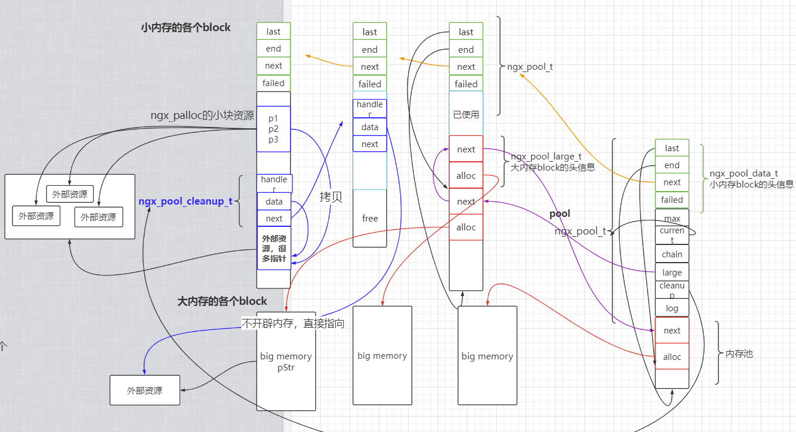

# nginx内存池源码移植

## 内存池整体结构

- `class ngx_mem_pool`对外接口

```c++
//  构造函数，创建内存池。
ngx_mem_pool(size_t size = NGX_DEFAULT_POOL_SIZE);
//  析构函数，释放内存池
~ngx_mem_pool();
//  考虑字节对齐，从内存池申请size大小的内存
void* ngx_palloc(size_t size);
//  不考虑字节对齐，从内存池申请size大小的内存
void* ngx_pnalloc(size_t size);
//  调用ngx_palloc，并初始化为0.
void* ngx_pcalloc(size_t size);
//  释放大块内存block。ngx不提供释放小块内存的接口。原因见博客
void ngx_pfree(void* p);
//  内存重置函数
void ngx_reset_pool();  
//  添加回调清理操作函数
ngx_pool_cleanup_t* ngx_pool_cleanup_add(size_t size);
```



## 内存池头部结构


### 整体

- 内存池
  
  ```cpp
  struct ngx_pool_s {
      ngx_pool_data_t       d;   //存储当前小块内存的存储情况
      size_t                max;      //存储小块内存和大块内存的分界线
      ngx_pool_s* current;      //指向第一个可以提供小块内存分配的小块内存池
      ngx_pool_large_s* large;//指向大块内存（链表）的入口地址
      ngx_pool_cleanup_s* cleanup;//指向所有预置的清理操作回调函数（链表）的入口
  };
  ```

### 小内存Block头信息

```cpp
struct ngx_pool_data_t {
    u_char* last;   //小块内存池可用内存起始地址
    u_char* end;    //小块内存池可用内存的末尾地址
    ngx_pool_s* next;  //所有小块内存池都被串在一条链表上
    ngx_uint_t      failed; //记录了当前小块内存池分配失败的次数
};
```

### 大内存Block头信息

```cpp
struct ngx_pool_large_s {
    ngx_pool_large_s* next; //所有的大块内存分配也是被串在一条链表上
    void* alloc;    //保存分配出去的大块内存的起始地址
};
```

### 外部资源 头信息

```cpp
typedef void (*ngx_pool_cleanup_pt)(void* data);
struct ngx_pool_cleanup_s {
    ngx_pool_cleanup_pt   handler; //定义一个函数指针，保存清理操作的回调函数
    void* data; //地址传递给回调函数的参数
    ngx_pool_cleanup_s* next;   //所有的cleanup清理操作都被串在一条链表上
};
```

## 创建内存池

### ngx_create_pool

- 创造的是一个内存Block，从操作系统malloc而来。有完整的ngx_pool_t，记录了整个内存池的信息。

```cpp
//  创建指定size大小的内存池，但是小块内存池大小不超过一个页面大小
void* ngx_mem_pool::ngx_create_pool(size_t size) {
    pool = (ngx_pool_s*)malloc(size);//根据用户指定大小开辟内存池
    if (pool == nullptr) {
        return nullptr;
    }
    //  初始化ngx_pool_data_t的信息
    pool->d.last = (u_char*)pool + sizeof(ngx_pool_s); //  内存池起始
    pool->d.end = (u_char*)pool + size; //  内存池末尾
    pool->d.next = nullptr; //  下一个小块内存
    pool->d.failed = 0;
    //  初始化内存池管理成员信息
    size = size - sizeof(ngx_pool_s);
    pool->max = (size < NGX_MAX_ALLOC_FROM_POOL) ? size : NGX_MAX_ALLOC_FROM_POOL;//和页面大小进行比较

    pool->current = pool;
    pool->large = nullptr;
    pool->cleanup = nullptr;

    return pool;
}
```

### 内存Block分配 ngx_palloc

- 小块内存分配、大块内存分配
- ngx_palloc 考虑了内存对齐

```cpp
//  考虑内存字节对齐，从内存池申请size大小的内存
void* ngx_mem_pool::ngx_palloc(size_t size) {
    if (size <= ngx_mem_pool::pool->max) { //申请内存小于一个页面
        return ngx_palloc_small(size, 1);//小块内存分配
    }
    return ngx_palloc_large(size);//大块内存分配
}
```

### ngx_palloc_small 小块内存分配

- 从操作系统开辟新的小块内存池。ngx_palloc_small调用ngx_palloc_block。

- **效率极高**：如何分配内存：通过移动last指针分配内存，将移出的size内存返回给上级。

- **分配流程**： 先尝试用已有的内存池中拿出size大小的内存块，当内存池里没有可分配的满足size大小的内存块时，再ngx_palloc_block开辟新block块。从block里拿出size大小的内存返回给上级。

```cpp
//  小块内存分配，内存池不够则从操作系统开辟。align=1意味着需要内存对齐
void* ngx_mem_pool::ngx_palloc_small(size_t size, ngx_uint_t align) {
    u_char* m;
    ngx_pool_s* p;

    p = pool->current; //指向当前内存池

    do {
        m = p->d.last; //指向内存池的空闲内存起始位置

        if (align) { //  如果要求对齐
            m = ngx_align_ptr(m, NGX_ALIGNMENT); //  内存对齐：把指针调整到平台相关的4/8倍数。
        }
        //  内存池的空闲内存大于要申请的内存
        if ((size_t)(p->d.end - m) >= size) {
            //  m指针偏移size字节，即内存池给应用程序分配内存
            p->d.last = m + size; 

            return m;
        }
        //  如果本block块剩余的不够size，那么顺着p->d.next向下走到第二个内存块block。
        p = p->d.next;

    } while (p);

    //  从pool->current开始 遍历完了 所有的block，也没找到够用的空闲内存
    //  那么就只能新开辟block
    return ngx_palloc_block(size);
}
```

ngx_palloc_block

- 原有内存池内存不够，开辟新的内存块加入内存池

```cpp
//  从操作系统malloc开辟新的小块内存池。
//  ngx_palloc_small调用ngx_palloc_block。ngx_palloc_block底层调用ngx_memalign。
// 在unix平台下ngx_memalign就是ngx_alloc。（就是对malloc的浅封装）
void* ngx_mem_pool::ngx_palloc_block(size_t size) {
    u_char* m;
    size_t       psize;
    ngx_pool_s* p, * newpool;

    psize = (size_t)(pool->d.end - (u_char*)pool); //  块大小，和ngx_create_pool中的size一样，即跟第一块小块内存池一样大

    m = (u_char*)malloc(psize);
    if (m == nullptr) {
        return nullptr;
    }

    newpool = (ngx_pool_s*)m;

    newpool->d.end = m + psize;
    newpool->d.next = nullptr;
    newpool->d.failed = 0;

    // 加上内存头部数据信息的大小
    m += sizeof(ngx_pool_data_t); //m指向空闲内存池起始地址
    m = ngx_align_ptr(m, NGX_ALIGNMENT);
    //[m, m + size]是即将分配出去的内存
    newpool->d.last = m + size;

    //  由于进入到这个函数必然意味着之前的block都分配内存失败
    //  所以要把前几个block的fail次数都++;
    //  当一个block了=块分配内存失败次数
    //  当一个block块失败次数>4之后，就认为这块Block的剩余内存已经很少，之后请求小内存时就不从这块Block开始请求
    for (p = pool->current; p->d.next; p = p->d.next) {
        if (p->d.failed++ > 4) {
            pool->current = p->d.next;
        }
    }

    p->d.next = newpool;

    return m;
}
```

### ngx_palloc_large 大内存块分配

- 从操统malloc大块内存。ngx_palloc_large调用ngx_alloc。ngx_alloc调用malloc
- malloc大块内存用于存储数据；从小内存池申请一块内存用作大内存池头信息；维护大内存池链表；将本次malloc的大块内存全部返回给上级使用。
- 

```cpp
//  大块内存分配
void* ngx_mem_pool::ngx_palloc_large(size_t size) {
    void* p;
    ngx_uint_t         n;
    ngx_pool_large_s* large;

    p = malloc(size);
    if (p == nullptr) {
        return nullptr;
    }

    n = 0;

    for (large = pool->large; large; large = large->next) {
        //  如果遍历到的这块大内存池节点的头信息的alloc==nullptr
        //  意味着并这个ngx_pool_large_t没有管理一块大内存。
        //  所以直接由它管理
        if (large->alloc == nullptr) { //  先遍历有没有free过的大块内存头信息节点
            large->alloc = p;
            return p;
        }

        if (n++ > 3) { //找了三次都没有找到空闲大内存头（前三个内存头不空闲），直接准备ngx_palloc_small分配
            break;
        }
    }

    //  向小内存池申请一段内存用作大内存池头信息
    large = (ngx_pool_large_s*)ngx_palloc_small(sizeof(ngx_pool_large_s), 1);
    if (large == nullptr) {
        free(p);    
        return nullptr;
    }

    //  将大内存池头插法插入large起始的链表中
    large->alloc = p;
    large->next = pool->large;
    pool->large = large;

    return p;
}
```

## 大小内存Block的重置 ngx_reset_pool

- `nginx`大块内存block通过`malloc`分配
  - 大块内存：通过`free`释放
- `nginx`小内存通过在内存池（的一个小内存块）中移动last指针来实现内存分配
  - 小块内存：无`free`释放，只是通过移动last指针来重置

```cpp
//  内存重置函数
void ngx_mem_pool::ngx_reset_pool() {
    ngx_pool_s* p;
    ngx_pool_large_s* l;
    //先重置大内存
    for (l = pool->large; l; l = l->next) {
        if (l->alloc) {
            free(l->alloc);
        }
    }
    //再重置小内存
    /*重置内存时，第二块小内存只有头部信息，不需要sizeof(头部信息与管理信息)
    for (p = pool; p; p = p->d.next) {
        p->d.last = (u_char*)p + sizeof(ngx_pool_s);
        p->d.failed = 0;
    }*/

    //处理第一块内存池
    p = pool;
    p->d.last = (u_char*)p + sizeof(ngx_pool_s);
    p->d.failed = 0;

    //从第二块内存池开始循环到最后一个内存池
    for (p = p->d.next; p; p = p->d.next) {
        p->d.last = (u_char*)p + sizeof(ngx_pool_data_t);
        p->d.failed = 0;
    }

    pool->current = pool;
    pool->large = nullptr;
}
```

## 释放指定大内存块 ngx_pfree

```cpp
void ngx_mem_pool::ngx_pfree(void* p) {
    ngx_pool_large_s* l;

    for (l = pool->large; l; l = l->next) {
        if (p == l->alloc) {
            free(l->alloc);
            l->alloc = nullptr;
            return;
        }
    }
}
```

## 为什么reset_pool中nginx内存池的小内存块不free释放？？

- 因为没有free小块内存的接口。

- 所以只能移动last指针

### 1. 为什么没free接口

- 首先nginx内存池的没办法回收针对某一特定小内存块进行free回收。
  
  - 因为从实现方式上来看，就释放不了。我们通过移动last指针来分配内存。可能我们要释放2号内存，但是我们只有last和end的两个指针，且last指向3号下的free内存。那么如果移动last到2那里然后free，那么就会把3也free掉
  
  
  
  - **因此**nginx**没有提供**free回收小块内存的接口函数
  - 所以重置时我们只能通过移动last指针来表示哪些内存是空闲内存

### 2. 为什么移动last可以

- 那么在释放内存时为什么移动last就可以。这样能表明装有没用数据的内存是空闲的，不害怕有用的内存被覆盖吗？
- 当`reset_pool`时，不会有有用的内存块。因为我们是短连接。
- `nginx`本质：`http`服务器。**短连接、间歇性。**
  - client向nginx server发送请求后，nginx处理完请求，并发送完response响应后；即一次服务处理完后，就主动和客户端断开tcp连接，该次连接的资源就都可以释放了。（server就像和client端没见过面一样。之前的东西都不必再保留，一干二净。）
  - **所以，当nginx server 处理完一次请求后，就可以调用`ngx_reset_pool`，free大块内存；将小块内存的last指针回退，等待下次覆盖。**
- 而**长连接**不论client是否发来请求，server和client是不能断开的。也即处理完请求后，连接也不能断开，资源也不允许释放，直到系统资源耗尽。长连接的这种server应该用SGI STL的二级空间配置器中的内存池。？？？？？？
  - 长连接举例：`http1.1 keep-alive = 60s`，即http服务器返回响应后，需等待`60s`。如果这段时间之内客户端又发来请求，那么重置等待时间。如果没发来请求，那么就断开连接。

## 内存池外部资源释放

### 外部资源信息头

```cpp
typedef void (*ngx_pool_cleanup_pt)(void* data);
struct ngx_pool_cleanup_s {
    ngx_pool_cleanup_pt   handler; //定义一个函数指针，保存清理操作的回调函数
    void* data; //地址传递给回调函数的参数
    ngx_pool_cleanup_s* next;   //所有的cleanup清理操作都被串在一条链表上
};
```

- cleanup_add功能概述：通过预置回调函数，实现c++中对象析构的功能。也即释放内存。

```cpp
//  添加回调清理操作函数
ngx_pool_cleanup_s* ngx_mem_pool::ngx_pool_cleanup_add(size_t size) {
    ngx_pool_cleanup_s* c;

    c = (ngx_pool_cleanup_s*)ngx_palloc(sizeof(ngx_pool_cleanup_s)); //创建清理操作的头信息的内存
    if (c == nullptr) {
        return nullptr;
    }

    if (size) {
        c->data = ngx_palloc(size);
        if (c->data == nullptr) {
            return nullptr;
        }
    }
    else {
        c->data = nullptr;
    }

    c->handler = nullptr;
    c->next = pool->cleanup;
    pool->cleanup = c;
    return c;
}
```

### 内存池销毁

- 先遍历链表执行外部资源的释放操作；再遍历链表执行释放大块内存的操作；再遍历链表重置小块内存Block

```cpp
//  内存池销毁函数
void ngx_mem_pool::ngx_destroy_pool() {
    ngx_pool_s* p, * n;
    ngx_pool_large_s* l;
    ngx_pool_cleanup_s* c;

    //  遍历外部资源信息头链表， 调用预设置的回调函数handler，释放外部资源。
    for (c = pool->cleanup; c; c = c->next) {
        if (c->handler) {
            c->handler(c->data);
        }
    }

    //  遍历大块内存信息头，释放大块内存
    for (l = pool->large; l; l = l->next) {
        if (l->alloc) {
            free(l->alloc);
        }
    }

    //  遍历小块内存信息头，释放小块内村
    for (p = pool, n = pool->d.next; /* void */; p = n, n = n->d.next) {
        free(p);
        if (n == nullptr) {
            break;
        }
    }
}
```

## nginx内存池不足

- 链表管理
  
  - 链表的查找遍历时间复杂度是 O(n)。ngx_pfree 效率不高

- 小内存块链表，current 问题：
  
  - 当遇到密集地分配比较大的小内存场景时，导致一些小内存block分配失败，其failed 次数增加。current 指向下一个block，由于前面的结点其实可能还有足够的空闲空间分配给其它小内存的，但由于单向链表导致空闲空间利用率不高。

- ngx_reset_pool中没有释放外部资源。需要等到destroy时才可以释放。

- ngx_reset_pool中，在重置小块内存的last指针时，有一部分没有重置，造成内存碎片。

- 没有针对小块内存的释放接口。

## 优点

- 分配小块内存十分高校：只需移动last指针

# SGI STL 二级空间配置器移植


## class <typename T> my_allocator

- volatile、lock_guard实现线程安全。_M_free_list_link是所有对象共有的静态成员，修改前需要加锁实现线程安全。

- my_allocator类
  
  - 对外接口
    - `T* allocate(size_t __n);`：用户向内存池请求内存
    - `void deallocate(void* __p, size_t __n);`：释放内存
    - `void* reallocate(void* __p, size_t __old_sz, size_t __new_sz);`：重写分配内存`
    - `template<typename Ty> void construct(T* __p, Ty&& val)`：构建对象
    - `void destory(void *p)`：销毁对象

## my_allocator导图

- freelist结构

- 整体

- _S_chunk_alloc

## SGI STL 二级空间配置器优点

- 对于每一个字节数的chunk块分配，都是返回给用户一个使用的【1】内存块，并给freelist一个【2】内存池，【3】并留有另一部分作为原始备用内存池。这个备用可以给当前的字节数freelist成员使用，也可以给其他字节数的freelist成员使用。
- 对于备用内存池划分chunk块以后，如果还有剩余的很小的内存块，再次分配的时候，会把这些小的内存块再次分配出去，备用内存池使用的一滴不剩。
- 当指定bytes字节数内存分配失败以后，有一个异常处理的过程，当前bytes -> 128bytes所有的chunk块进行查看，如果哪个freelist成员下的内存链表池中有chunk块，借一个出去。
  - 如果操作失败，会调用`_S_start_free = (char*)malloc_alloc::allocate(__bytes_to_get)`来malloc内存；
    - `allocate`里面通过调用`oom_malloc`，来调用预先设置好的回调函数`__malloc_alloc_oom_handler`。用于处理`malloc`失败的情况。以返回用户请求的bytes大小内存

## 缺点

- STL二级空间配置器虽然解决了外部碎片与提高了效率，但它同时增加了一些缺点：
  - 因为自由链表的管理问题，它会把我们需求的内存块自动提升为8的倍数，这时若你需要1个字节，它 会给你8个字节，即浪费了7个字节，所以它又引入了内部碎片的问题，若相似情况出现很多次，就会造 成很多内部碎片；
    - 二级配置器可以很好的解决频繁调用malloc带来的时间消耗以及额外内存消耗，但是与此同时，内存池分配的小块内存都是8的倍数，也会存在一定的内部碎片，但相对于malloc而言，其性能还是好的。——侯捷
