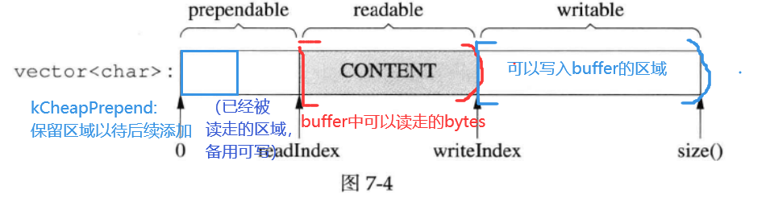
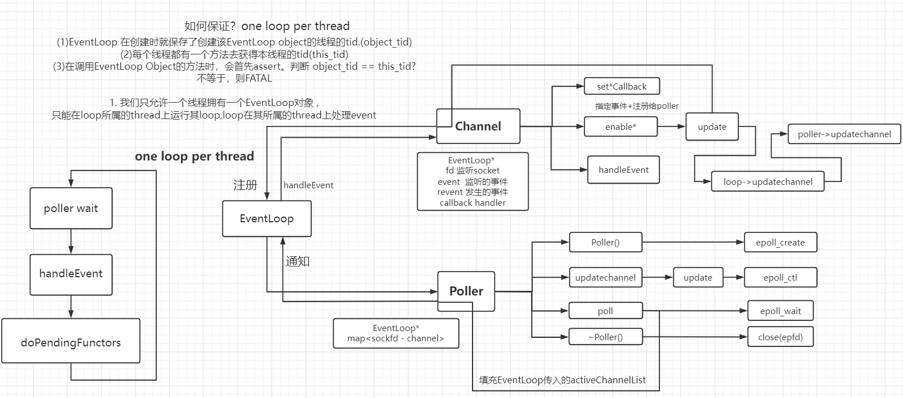
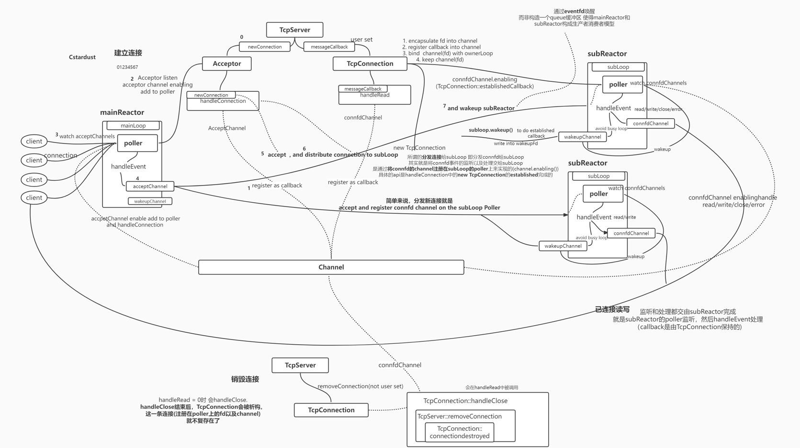
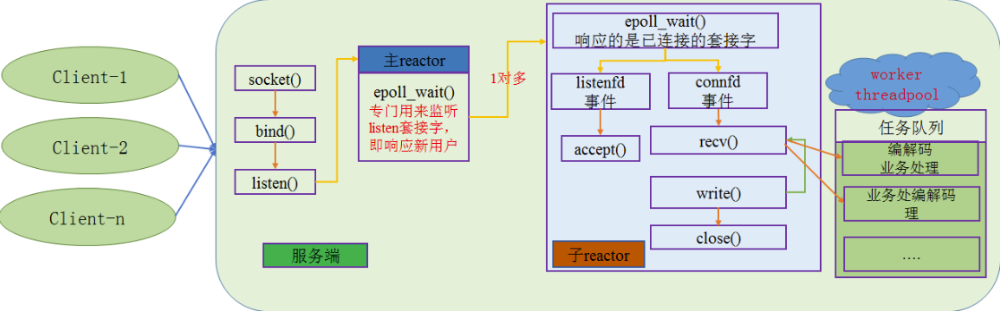

## 阻塞、非阻塞、同步、异步

一个典型的网络IO接口调用，分为两个阶段，分别是“**数据就绪**”（根据系统IO操作的就绪状态）和“**数据读写**”（根据应用程序和内核的交互方式），数据就绪阶段分为阻塞和非阻塞。

- 同步表示A向B请求调用一个网络IO接口时（或者调用某个业务逻辑API接口时），数据的读写都是由请求方A自己来完成的（不管是阻塞还是非阻塞）；

- 异步表示A向B请求调用一个网络IO接口时（或者调用某个业务逻辑API接口时），向B传入请求的事件以及事件发生时通知的方式，A就可以处理其它逻辑了，当B监听到事件处理完成后，会用事先约定好的通知方式，通知A处理结果。

## select和poll的缺点 select的缺点：

1. 单个进程能够监视的文件描述符的数量存在最大限制，通常是1024，当然可以更改数量，但由于 select采用轮询的方式扫描文件描述符，文件描述符数量越多，性能越差；

2. 内核 / 用户空间内存拷贝问题，select需要复制大量的句柄数据结构，产生巨大的开销；

3. select返回的是含有整个句柄的数组，应用程序需要遍历整个数组才能发现哪些句柄发生了事件 ；

4. select的触发方式是水平触发，应用程序如果没有完成对一个已经就绪的文件描述符进行IO操作， 那么之后每次select调用还是会将这些文件描述符通知进程；

5. 相比select模型，poll使用链表保存文件描述符，因此没有了监视文件数量的限制，但其他三个缺点依 然存在。

## 好的网络服务器设计

non-blocking 几乎总是和 IO-multiplexing 一起使用，原因有两点：

- 没有人真的会用轮询 (busy-pooling) 来检查某个 non-blocking IO 操作是否完成，这样太浪费CPU资源了。

- IO-multiplex 一般不能和 blocking IO 用在一起，因为 blocking IO 中read()/ write()  /accept()/ connect() 都有可能阻塞当前线程，这样线程就没办法处理其他socket上的 IO 事件了。

所以，当我们提到 non-blocking 的时候，实际上指的是**non-blocking + IO-multiplexing**，单用其中任何一个都没有办法很好的实现功能。

## Buffer

### outputBuffer

**概述**：muduo中，user不会自己直接write socket，也不会直接操作outputBuffer，而是**间接**的。通过`TcpConnection::send()`,来决定是write socket 还是操作outputBuffer。

程序通过TCP连接发送100KB数据，但是在write调用中，只接受了80KB，那么就需要有一个**outputBuffer**，来接管这20KB。

对于每个TcpConnection都有一个outputBuffer

- **如果outputBuffer中没有数据的话**，那么直接发送。
  - 如果一次发送完，那么并不需要将数据加入outputBuffer，也不需要在Poller上注册EPOLLOUT事件。
  - 如果发送完还剩20KB的话，TcpConnection将未发送完的数据20KB保存outputBuffer中，并再Poller上给fd注册POLLOUT事件。
  - 之后，如果socket缓冲区变得可写，poller监测到write事件时，loop会调用TcpConnection::handleWrite() 将outputBuffer中的剩余数据发送出去。
  - 当outputBuffer中的数据写完时，Poller就停止监听POLLOUT。避免busy loop。
- **如果outputBuffer中有数据的话**，那么不直接发送，而是先将这xxKBappend到outputBuffer的20KB的data之后，等到socket可写时，一并写入socket。而不是直接发送。

### inputBuffer

**概述**：socket从网卡中读来的数据 都会由TcpConnection先读入inputBuffer。然后，将inputBuffer交由user来处理。user拿到inputBuffer时，里面就已经有了这次读到的所有数据。

网络库在处理socket可读事件时，必须**一次性把socket 接收缓冲区里的数据读完，user从网络库的Buffer里面取数据即可**。（从kenrel的Buffer搬到应用层的Buffer），否则会反复触发POLLIN事件，造成busy-loop。

### 结构



- readable和writable都是针对Buffer来说的。
  - readable : 可以从Buffer中读出的数据给fd
  - writable : 还可以从fd向Buffer中写入
- prependable = readInx
- readable = writeIndex - readIndex
- writable = buffer_.size() - writeIndex

## TcpConnectionPtr

- **TcpConnection的引用存在于**
  
  - **TcpServe**中的`connections_<name,TcpConnectionPtr>`。shared_ptr引用计数 = 1
  - **channel 中的weak_ptr 当handleEvent时 会lock为shared_ptr(即TcpConnectionPtr)** 。引用计数++ 保证在handleEvent时不会析构TcpConnection，因为
  - 还有就是在连接断开时的局部变量TcpConnectionPtr 以及 bind参数时候的拷贝TcpConnectionPtr。

- **一个TcpConnection何时析构？**
  
  - 断开连接后，TcpConnectionPtr = 0
  - TcpConnection::handleRead没有读到数据，接着进行handleClose
  - 对端关闭了连接，整个handleEvent(handleClose)结束之后(最后一个成员函数是connetionDestroyed），TcpConnectionPtr = 0，此时TcpConnection析构（channel也就跟着析构）

- 将一条连接断开都需要做什么操作
  
  - 大概来讲 就是
    - 取消对该fd的监听 ：channel_->disableAll() — TcpConnection内做TcpConnection::handleClose)
    - 执行user设置的callback：connectionCallback_(connPtr); — TcpConnection内做
    - 将TcpConnection从TcpServer中的记录移除：connections_.erase(conn->name()); — TcpServer内做（TcpServer::removeConnection）
    - channel从poller中删除掉 — TcpConnection内做 （TcpConnection::connectDestroyed）

- **poller -> channel::closeCallback -> TcpConnection::handleClose -> TcpServer::removeConnection -> TcpConnection::connectionDestoyed**

## EventLoop

- loop三大状态:

```cpp
while(1)
{
    poller wait
    handleEvents
    doPendingFunctors
}
```

- 主要包含：
  
  - Channel - lfd、cfd或者eventfd的抽象
  
  - Poller



**作用：循环 监听事件，获取活跃事件，并且根据发生events，来handleEvent**

- EventLoop 通过调用 Poller 和 Channel 并协作。
- Poller: 监听并获取发生事件 上传给EventLoop(activeChannelList)
- Channel: 封装fd以及相应event以及相应callback。EventLoop根据Poller上传的channel 来调用handleEvent 处理事件。

**mainReactor在建立新连接后，通过写eventFd唤醒subReactor. subReactor将connfd注册在其epoll上，之后负责监听处理connfd所有的读写事件.**

**如何分发连接：**

- mainReactor调用subReactor的eventloop的runInLoop
  
  - 将connfd的connectionEstablished放入eventloop(pendingFunctor)
  
  - wakeup唤醒eventloop

- subReactor的Eventloop被唤醒。在doPendingFunctor中通过TcpConnection::connectionEstablished真正实现分发连接. 将该connfd的读写事件注册到本channel所属TCPConnection的loop的poller上

### runInLoop与queueInLoop调用时机

- **runInLoop**
  
  - loop 所属 thread 内执行 runInLoop :
    - 必然是在handleEvents中，调用了runInLoop，此时处于LoopThread内，于是在io thread内直接执行cb。
  - 其他 thread 执行runInLoop :
    - 进入queueInLoop，把cb加入到pendingFunctor中。为了让io loop尽快执行我们的cb，于是我们wakeupFd。

- **queueInLoop**
  
  - loop 所属 thread 执行queueInLoop
    - handleEvent中调用queueInLoop
      - 加入pendingFunctor，但无需wakeup。因为IO thread已经从Poller中离开，handleEvents之后就会执行cb。
    - doPendingFunctors
      - 加入pendingFunctor，且需要wakeup。因为这个cb直到下次poller wait之后 才会被处理。(通过callingPendingFactors_判断是否需要wakeup)
  - 其他thread 执行queueInLoop : cb放入队列，为了让io loop尽快执行我们的cb，于是我们wakeupFd。（这样下次IO thread运行到poller wait就会直接返回，如果不这样的话cb会被延迟处理）

### Channel

- 实际使用中可分为三种channel : acceptChannel(listengingfd) , connfdChannel,(connfd) wakeupChannel(wakeupFd)

- **重要成员**
  
  - 管理的fd
  - 挂在epoll tree上的fd的事件 如fd的EPOLLIN、EPOLLOUT
  - poller实际监听到的事件
  - EventHandler事件回调（读，写，关闭连接以及error回调）

### Poller

- Poller：封装 event-based核心的IO复用(epoll_开头的相关)函数 的模块。

- epoll为例子

- **重要成员**
  
  - **epollfd_** : epfd
  - **events_** : 存储发生事件的集合。传递给epoll
  - **ownerLoop_** : 所属eventLoop
  - **channels<fd,Channel*>** : 记录注册在poller上的fd以及channel。用于将监听的channel 和 记录的channel 进行检验。

## TcpServer



- 重要成员：
  
  - unique_ptr<Acceptor.> **acceptor_**
    
    - TcpServer::newConnection 绑定给acceptor
    - acceptor接收新连接之后 将该连接分发给threadPool中的subloop(subReactor)
  
  - shared_ptr<EventLoopThreadPool.> **threadPool_**
    
    - subReactors pool

- 重要函数
  
  - **newConnection** ：accept新连接之后， 会调用acceptor的handleConnection，handleConnection会执行newConnection。
    
    - 将新连接**派发**给subloop，即将新建立连接的connfd的监听和处理都交给一个ioloop
      - **通过new TcpConnection**。TcpConnection会负责将subloop和connfd的channel绑定在一起。即将channel注册在subloop的poller上(在TcpConnection::connectionEstablished中执行)。
    - **唤醒** 派发到的(subloop)subReactor,使其处理新连接的connectionEstablished 
      - **wakeupFd**
      - subloop此时应当阻塞在poller wait上。main thread 通过向其监听的wakeupFd写入data，使其从poller wait中离开。
  
  - removeConnection：注册在TcpConnection::handleClose中。
    
    - 关闭连接。流程见下文
  
  - **start**
    
    - 启动EventLoopThreadPool中的subloop
    - mainloop 开启listening queue 并注册监听listenfd到mainloop的Poller上。
  
  - setsubThreadNum
    
    - 设置subReactor数量。
      
      - num = 0. 则只有一个reactor，既负责监听、处理listening fd的新连接建立事件，又负责监听、处理已连接socket connfd的读写事件。
      
      - num > 0. 则一个mainReactor num个subReacor。
        
        - mainReactor 的mainloop负责监听处理listeningfd的新连接建立事件。
        - subReactor 的subloop负责监听处理connfd的读写事件)
        
        

### Acceptor

- **Acceptor**：封装了listening fd 以及 连接event 以及 处理连接事件的callback ： handleConnection

- - acceptSocket_：listening fd
  - acceptChannel_：listening fd 以及 监听事件 以及 回调
  - EventLoop *loop：listening fd 所属的eventLoop。一般是main thread 的 eventLoop.
  - newConnectionCallback_: TcpServer构造函数中将 TcpServer::newConnection 绑定给acceptor。故acceptor接收连接之后 分发client的channel给ioloop。

- **重要函数**
  
  - **handleConnection**
    
    - 当poller epoll wait 监听到连接事件时 会调用该回调
      
      - 1. handleConnection : accept连接 得到新connfd
      - 2. newConnectionCallback(TcpServer绑定的) : 本mainReactor选择一个subReactor 将连接派发。
    
    - 核心逻辑如下
      
      ```cpp
      void Acceptor :: handleConnection(Timestamp)
      {
          InetAddress peerAddr;
          int connfd = acceptSocket_.accept(&peerAddr);               //  accpet
          InetAddress localAddr(InetAddress::getSockName(connfd));    // 获取本机信息
          newConnectionCallback_(connfd,peerAddr,localAddr);          //  轮询subloop 唤醒 分发当前新client的channel
          ...
      }
      ```

- **listen**
  
  - socket开启listen队列，poller监听连接事件，等待connect。

### TcpConnection

- 与acceptor平级
  
  - **acceptor** : **负责listening fd 的accept。**
    - **mainloop中的 封装listenfd、相关事件及回调.(监听、接受连接、分发连接给subLoop)**
  - **tcpconntcion** : **负责一个connfd的通信**
    - **subloop中的 封装已连接connfd、相关事件及回调.(读消息事件、发送消息事件、连接关闭事件、错误事件等)**

- **功能**
  
  - **1. encapsulate fd into channel**
  - **2. register callback into channel** and keep callback
  - **3. bind ownerLoop and channel(fd)** : channel enabling -> reigster on the poller. 即所谓的派发连接给subloop，就是将指定subloop的poller监听、处理channel(fd)的event。
  - **4. keep channel(fd)**

- **重要成员**
  
  - **socket_** : connfd
  - **connectionEstablished:** 连接建立完成后调用
    - **将connfd的读事件注册在poller上**
      - channel_->enableReading()
    - **调用user set connectionCallback**
    - connectionEstablished在TcpServer::newConnection中被调用
  - **connectionDestroyed ：** 销毁连接
    - 会调用到user set connectionCallback
    - 销毁连接时会通过调用TcpServer::removeConnection来销毁连接
      - removeConnection -> removeConnectionInLoop -> connectionDestroyed
  - **channel_** : connfd的事件(感兴趣和实际发生)以及回调(读、写、关闭连接等)。
    - 这个Channel的**callback**是在TcpConnection对象构造函数中注册的。
      - 这些**callback最终都会在loop的handleEvent中被调用**
      - **TcpConnection::handleRead / handleClose / handleError / handleWrite**
        - handleRead中会调用user set的messageCallback_
        - 同理 handleWrite 有 user set 的 writeCompleteCallback_
        - handleCose 有 closeCallback_
  - **loop_**：本TcpConnection所属的subloop
  - inputBuffer_：user态的接收缓冲区。
  - outputBuffer_：user态的发送缓冲区。
  - state_：当前TCP连接的状态（Connected、Connecting、Disconnecting、Disconnected）
  - **connetionCallback_、messageCallback_、writeCompleteCallback_**
    - **交给用户自定义**。（这也是用户唯数不多的自由）
  - closeCallback_ ：
    - muduo TcpServer自己定义的（不交给用户）
  - 用户如何自定义？
    - TcpServer给了用户这样的接口。如setConnectionCallback。之后TcpServer再传给TcpConnection

- **重要函数**
  
  - **handleRead()**
    - 处理读事件，将内容存入inputBuffer
    - 然后再调用user set的messageCallback_
  - **handleWrite()**
    - 负责处理epoll上注册的Tcp连接的可写事件（即写数据给fd）。视情况与outputBuffer交互。
    - 写完之后 调用 writeCompleteCallback_
  - **handleClose()**
    - 负责处理Tcp连接关闭的事件。
      - 将本TCP Connection的fd 的 channel_从poller中移除
      - connectionCallback_ (user set)
      - closeCallback_(muduo set)
  - **send**
    - send -> sendInLoop ->注册handleWrite

## EventLoopThreadPool

EventLoopThread - subReactor

EventLoopThreadPool - subReactorPool

- **重要成员**
  
  - vector<unique_ptr> subReactors_ ：管理一堆subReactor，即EventLoopThread
  - vector<EventLoop*> loops_：记录一堆subReactor的loop

- **重要函数**
  
  - start : 开启subReactors(EventLoopThreads)
  
  - getNextLoop : 轮询到一个subReactor的Loop，返回给上层。

### Thread

- **可复用于thread Pool。不只用于MuDuo**

- **Thread class 封装了**
  
  - 1. 开启/结束/分离线程
  - 2. 注册线程函数 threadFunc
  - 3. 记录线程信息 如tid,name…

- **重要成员**
  
  - `shared_ptr<std::thread> thread_`
    - 不能直接造thread对象。因为thread对象一构造就开始运行。如果构造了thread对象，那么需要在构造函数初始化，那么一初始化线程就开始运行。
  - ThreadFunc func_：thread func

- **重要函数**
  
  - start : 开启thread，并记录tid(注意lock and cond避免data Race)
  - join : 等待thread结束

### EventLoopThread

- EventLoopThread: **将loop和thread结合在一起 ， 实现 one loop per thread**
  
  - 封装了 class Thread 和 EventLoop
  - 实现 one loop per thread
    - 在 threadFunc中创建 EventLoop 对象 并运行loop.loop()：开启循环监听。
    - 这样 通过EventLoopThread开启一个thread即代表开启一个loop。开启一个loop即代表开启了一个reactor。
  - **所以一个EventLoopThread 其实 就可以看成一个 reactor**

- **重要成员**
  
  - EventLoop *loop_ : 记录thread_中创建的EventLoop
  - Thread thread_ : 负责开启thread

- **重要函数**
  
  - startLoop : 开启thread，记录loop_*
  - threadFunc : 注册在Thread类。跑在thread上。创建EventLoop 并 loop.loop(). 实现 one loop per thread
